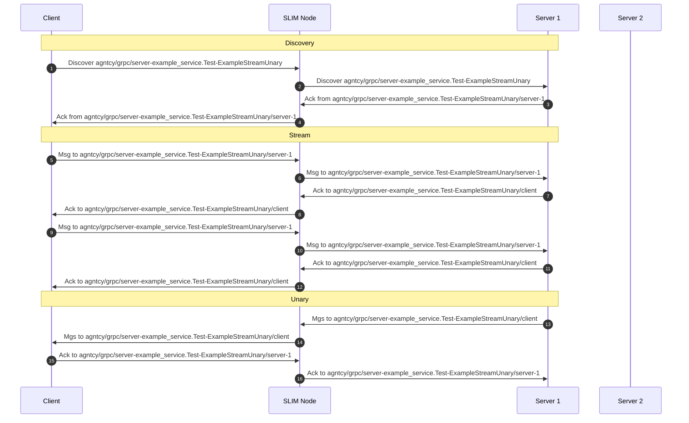

# SRPC (SLIM Remote Procedure Call)

SRPC, or SLIM Remote Procedure Call, is a mechanism designed to enable Protocol
Buffers (protobuf) RPC over SLIM (Secure Low-latency Inter-process Messaging).
This is analogous to gRPC, which leverages HTTP/2 as its underlying transport
layer for protobuf RPC.

A key advantage of SRPC lies in its ability to seamlessly integrate SLIM as the
transport protocol for inter-application message exchange. This significantly
simplifies development: a protobuf file can be compiled to generate code that
utilizes SLIM for communication. Application developers can then interact with
the generated code much like they would with standard gRPC, while benefiting
from the inherent security features and efficiency provided by the SLIM
protocol.

This README provides a guide to understanding how SRPC functions and how you can
implement it in your applications. For detailed instructions on compiling a
protobuf file to obtain the necessary SRPC stub code, please refer to the
dedicated [README file of the SRPC compiler](../../../srpc-compiler/README.md).

## SLIM naming in SRPC

In SRPC, each service and its individual RPC handlers are assigned a SLIM name,
facilitating efficient message routing and processing. Consider the [example
protobuf](./srpc/examples/simple/example.proto) definition, which defines four
distinct services:

```
syntax = "proto3";

package example_service;

service Test {
  rpc ExampleUnaryUnary(ExampleRequest) returns (ExampleResponse);
  rpc ExampleUnaryStream(ExampleRequest) returns (stream ExampleResponse);
  rpc ExampleStreamUnary(stream ExampleRequest) returns (ExampleResponse);
  rpc ExampleStreamStream(stream ExampleRequest) returns (stream ExampleResponse);
}
```

This example showcases the four primary communication patterns supported by
gRPC: Unary-Unary, Unary-Stream, Stream-Unary, and Stream-Stream.

For SRPC, a specific SLIM name is generated for each handler within a service.
This naming convention allows an application exposing the service to listen for
and process messages intended for a particular RPC method. The format for these
names is:

```
{package-name}.{service-name}-{handler_name}
```

Based on the example_service.Test definition, the names for each handler would
be:

```
example_service.Test-ExampleUnaryUnary
example_service.Test-ExampleUnaryStream
example_service.Test-ExampleStreamUnary
example_service.Test-ExampleStreamStream
```

This handler name is appended to the second component of the SLIM name
associated with the running application. For instance, to receive messages for
`example_service.Test-ExampleUnaryUnary`, an application would subscribe to:

```
component[0]/component[1]/component[2]-example_service.Test-ExampleUnaryUnary/component[3]
```

The subscription process is entirely managed by the SRPC package. Application
developers are not required to explicitly handle SLIM name subscriptions.
Instead, they only need to implement the specific functions that will be invoked
when a message arrives for a defined RPC method.

## Example

This section provides a detailed walkthrough of a basic SRPC client-server
interaction, leveraging the simple example provided in
[example](./srpc/examples/simple/) folder.

### Generated Code

The foundation of this example is the `example.proto` file, which is a
standard Protocol Buffers definition file. This file is compiled using the SRPC
compiler (refer to the [SRPC Compiler README] for installation and usage
instructions) to generate the necessary Python stub code. The generated code is
available in two files: `example_pb2.py` and `example_pb2_srpc.py`.
Specifically, `example_pb2_srpc.py` contains the SRPC-specific stubs for
both client and server implementations. Below are the key classes and functions
generated by the compiler:

_Client Stub (TestStub)_: The TestStub class represents the client-side
interface for interacting with the Test service. It provides methods for each
RPC defined in example.proto, allowing clients to initiate calls to the server.

```python
class TestStub:
    """Client stub for Test."""
    def __init__(self, channel):
        """Constructor.

        Args:
            channel: A slimrpc.Channel.
        """
        self.ExampleUnaryUnary = channel.unary_unary(
            "/example_service.Test/ExampleUnaryUnary",
            request_serializer=pb2.ExampleRequest.SerializeToString,
            response_deserializer=pb2.ExampleResponse.FromString,
        )
        self.ExampleUnaryStream = channel.unary_stream(
            "/example_service.Test/ExampleUnaryStream",
            request_serializer=pb2.ExampleRequest.SerializeToString,
            response_deserializer=pb2.ExampleResponse.FromString,
        )
        self.ExampleStreamUnary = channel.stream_unary(
            "/example_service.Test/ExampleStreamUnary",
            request_serializer=pb2.ExampleRequest.SerializeToString,
            response_deserializer=pb2.ExampleResponse.FromString,
        )
        self.ExampleStreamStream = channel.stream_stream(
            "/example_service.Test/ExampleStreamStream",
            request_serializer=pb2.ExampleRequest.SerializeToString,
            response_deserializer=pb2.ExampleResponse.FromString,
        )
```

_Server Servicer (TestServicer)_: The TestServicer class defines the server-side
interface. Developers implement this class to provide the actual business logic
for each RPC method.

```python
class TestServicer():
    """Server servicer for Test. Implement this class to provide your service logic."""

    def ExampleUnaryUnary(self, request, context):
        """Method for ExampleUnaryUnary. Implement your service logic here."""
        raise slimrpc_rpc.SRPCResponseError(
            code=code__pb2.UNIMPLEMENTED, message="Method not implemented!"
        )
    def ExampleUnaryStream(self, request, context):
        """Method for ExampleUnaryStream. Implement your service logic here."""
        raise slimrpc_rpc.SRPCResponseError(
            code=code__pb2.UNIMPLEMENTED, message="Method not implemented!"
        )
    def ExampleStreamUnary(self, request_iterator, context):
        """Method for ExampleStreamUnary. Implement your service logic here."""
        raise slimrpc_rpc.SRPCResponseError(
            code=code__pb2.UNIMPLEMENTED, message="Method not implemented!"
        )
    def ExampleStreamStream(self, request_iterator, context):
        """Method for ExampleStreamStream. Implement your service logic here."""
        raise slimrpc_rpc.SRPCResponseError(
            code=code__pb2.UNIMPLEMENTED, message="Method not implemented!"
        )
```

_Server Registration Function (add_TestServicer_to_server)_: This utility
function registers an implemented TestServicer instance with an SRPC server. It
maps RPC method names to their corresponding handlers and specifies the request
deserialization and response serialization routines.

```python
def add_TestServicer_to_server(servicer, server: slimrpc.Server):
    rpc_method_handlers = {
        "ExampleUnaryUnary": slimrpc.unary_unary_rpc_method_handler(
            behaviour=servicer.ExampleUnaryUnary,
            request_deserializer=pb2.ExampleRequest.FromString,
            response_serializer=pb2.ExampleResponse.SerializeToString,
        ),
        "ExampleUnaryStream": slimrpc.unary_stream_rpc_method_handler(
            behaviour=servicer.ExampleUnaryStream,
            request_deserializer=pb2.ExampleRequest.FromString,
            response_serializer=pb2.ExampleResponse.SerializeToString,
        ),
        "ExampleStreamUnary": slimrpc.stream_unary_rpc_method_handler(
            behaviour=servicer.ExampleStreamUnary,
            request_deserializer=pb2.ExampleRequest.FromString,
            response_serializer=pb2.ExampleResponse.SerializeToString,
        ),
        "ExampleStreamStream": slimrpc.stream_stream_rpc_method_handler(
            behaviour=servicer.ExampleStreamStream,
            request_deserializer=pb2.ExampleRequest.FromString,
            response_serializer=pb2.ExampleResponse.SerializeToString,
        ),

    }

    server.register_method_handlers(
        "example_service.Test",
        rpc_method_handlers,
    )
```

### Server implementation

The server-side logic is defined in
[server.py](./srpc/examples/simple/server.py). Similar to standard gRPC
implementations, the core service functionality is provided by the TestService
class, which inherits from TestServicer (as introduced in the previous section).
This class contains the concrete implementations for each of the defined RPC
methods.

The SLIM-specific code and configuration is handled within the amain()
asynchronous function. This function utilizes the create_server helper to
instantiate an SRPC server:

```python
def create_server(
    local: str,
    slim: dict,
    enable_opentelemetry: bool = False,
    shared_secret: str = "",
) -> Server:
    """
    Create a new SRPC server instance.
    """
    server = Server(
        local=local,
        slim=slim,
        enable_opentelemetry=enable_opentelemetry,
        shared_secret=shared_secret,
    )

    return server


async def amain() -> None:
    server = create_server(
        local="agntcy/grpc/server",
        slim={
            "endpoint": "http://localhost:46357",
            "tls": {
                "insecure": True,
            },
        },
        enable_opentelemetry=False,
        shared_secret="my_shared_secret",
    )

    # Create RPCs
    add_TestServicer_to_server(
        TestService(),
        server,
    )

    await server.run()
```

A new server application is created using the `create_server` function. The
local parameter, set to "agntcy/grpc/server", assigns a SLIM name to this server
application.

This name is then used to construct the full SLIM RPC names for each method:

```
agntcy/grpc/server-example_service.Test-ExampleUnaryUnary
agntcy/grpc/server-example_service.Test-ExampleUnaryStream
agntcy/grpc/server-example_service.Test-ExampleStreamUnary
agntcy/grpc/server-example_service.Test-ExampleStreamStream
```

Additionally, the `slim` dictionary configures the server to connect to a
SLIM node running at `http://localhost:46357`. The tls setting `insecure:
True` disables TLS for simplicity in this example. The `shared_secret`
parameter is used for initializing the Message Layer Security (MLS) protocol.
Note that using a hardcoded shared_secret like "my_shared_secret" is not
recommended, please refer to the documentation for proper MLS configuration.

Finally, the add_TestServicer_to_server function is called to register the
implemented TestService with the SRPC server, making its RPC methods available.

```python
    # Create RPCs
    add_TestServicer_to_server(
        TestService(),
        server,
    )
```

### Client implementation

The client-side implementation, found in
[client.py](./srpc/examples/simple/client.py), largely mirrors the structure of
a standard gRPC client. The primary distinction and SLIM-specific aspect lies in
the creation of the SRPC channel:

```python
    channel_factory = slimrpc.ChannelFactory(
        slim_app_config=slimrpc.SLIMAppConfig(
            identity="agntcy/grpc/client",
            slim_client_config={
                "endpoint": "http://localhost:46357",
                "tls": {
                    "insecure": True,
                },
            },
            enable_opentelemetry=False,
            shared_secret="my_shared_secret",
        ),
    )

    channel = channel_factory.new_channel(remote="agntcy/grpc/server")

    # Stubs
    stubs = TestStub(channel)
```

As for the server case the `local` parameter, set to
`agntcy/grpc/client`, assigns a SLIM name to the client application. This
results in the client's internal RPC handlers being named:

```
agntcy/grpc/client-example_service.Test-ExampleUnaryUnary
agntcy/grpc/client-example_service.Test-ExampleUnaryStream
agntcy/grpc/client-example_service.Test-ExampleStreamUnary
agntcy/grpc/client-example_service.Test-ExampleStreamStream
```

Also, like in the case of the server application, the `slim` dictionary
specifies the SLIM node endpoint (http://localhost:46357) and TLS settings,
consistent with the server's configuration, while `shared_secret` initialize
MLS to match the server setup.

The remote parameter, set to "agntcy/grpc/server", explicitly identifies the
SLIM name of the target server application. This allows the SRPC channel to
correctly route messages to the appropriate server endpoint within the SLIM
network.

## SRPC under the hood

SRPC was introduced to simplify the integration of existing applications with
SLIM. From a developer's perspective, using SRPC or gRPC is almost identical.
Application developers do not need to manage endpoint names or connectivity
details, as these aspects are handled automatically by SRPC and SLIM.

All RPC services underneath utilize a sticky point-to-point session. The SLIM
session creation is implemented in inside SRPC in
[channel.py](./srpc/channel.py):

```python
        # Create a session
        session = await self.local_app.create_session(
            slim_bindings.PySessionConfiguration.FireAndForget(
                max_retries=10,
                timeout=datetime.timedelta(seconds=1),
                sticky=True,
            )
        )
```

This session used by SRPC is also reliable. For each message, the sender waits
for an acknowledgment (ACK) packet for 1 second
(`timeout=datetime.timedelta(seconds=1)`). If no acknowledgment is received,
the message will be re-sent up to 10 times (`max_retries=10`) before
notifying the application of a communication error.

Since the session is sticky, all messages in a streaming communication will be
forwarded to the same application instance. Let's illustrate this with an
example using the client and server applications described above.

Imagine two server instances running the same RPC service. In this example We'll
focus on the Stream-Unary service, which is served by both server instances
under the general name
`agntcy/grpc/server-example_service.Test-ExampleStreamUnary`. In SLIM, each
application receives a unique ID. Thus, the full service name will include a
fourth component containing the server's ID. This ID is generated by SLIM itself
(see the doc from more details). Here we will use server-1 and server-2 for
simplicity. So, the two full names for the services will be:

- `agntcy/grpc/server-example_service.Test-ExampleStreamUnary/server-1`
- `agntcy/grpc/server-example_service.Test-ExampleStreamUnary/server-2`

Now, if a new client wants to use the Stream-Unary service it needs to knows
only the general name
`agntcy/grpc/server-example_service.Test-ExampleStreamUnary`. SRPC will
leverage SLIM's capabilities to first discover one of the available services,
and then SRPC will use its full, specific name to consistently communicate with
that same endpoint.



The initial messages in the sequence diagram are used for the discovery phase.
After this step, the client application knows the specific name of the service
running on server-1. It's important to note that the first message in the
discovery phase is sent in anycast from the SLIM node, meaning it could be
forwarded to either of the two running servers. For instance, a subsequent call
of the same RPC from the same client might be served by server-2.

After the discovery, the client will always send messages to the same endpoint,
as demonstrated in the streaming session phase in the example.

Finally, the server is expected to send one message to the client to close the
service. The server learns the client's address (where to forward the message)
by examining the source field of all received messages.
