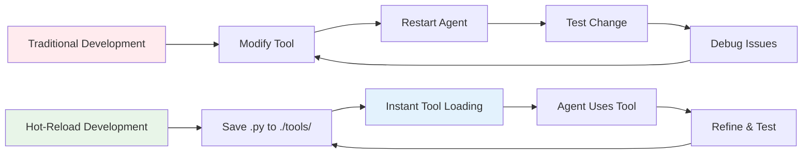
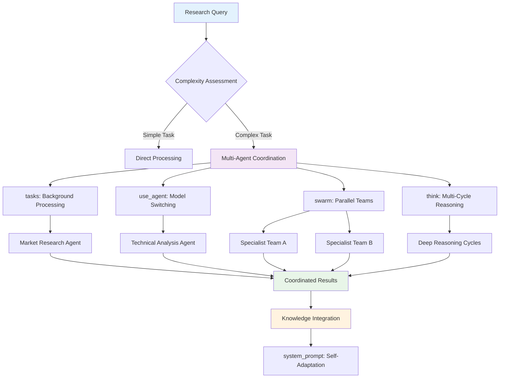
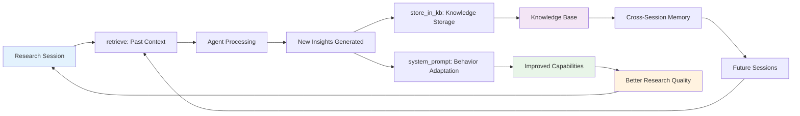
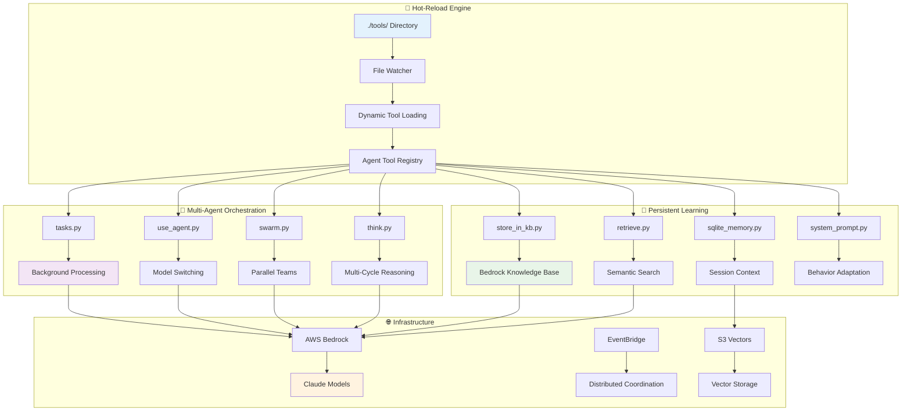

# Strands Research Agent

[](https://strandsagents.com)
[](https://pypi.org/project/strands-research-agent/)
[](https://pypi.org/project/strands-research-agent/)

A production-ready autonomous research agent demonstrating advanced Strands Agents patterns including hot-reloading tools, multi-agent coordination, and persistent learning systems for enterprise research automation.

## Feature Overview

- **Hot-Reloading Development**: Create and modify tools without restarting - save `.py` files in `./tools/` for instant availability
- **Multi-Agent Orchestration**: Background tasks, parallel processing, and model coordination across different providers
- **Persistent Learning**: Cross-session knowledge accumulation via AWS Bedrock Knowledge Base and SQLite memory
- **Self-Modifying Systems**: Dynamic behavior adaptation through the `system_prompt` tool and continuous improvement loops



## Quick Start

```bash
# Install the research agent
pip install strands-research-agent[all]

# Configure your model (Bedrock recommended)
export STRANDS_MODEL_ID="us.anthropic.claude-sonnet-4-20250514-v1:0"
export MODEL_PROVIDER="bedrock"

# Start interactive research
research-agent
```

```python
# Agent creates its own tools and uses them immediately
agent("Create tools for competitive intelligence analysis and start researching AI agent frameworks")

# What happens behind the scenes:
# 1. Agent recognizes it needs specialized capabilities
# 2. Creates competitive_intel.py in ./tools/ (hot-loaded instantly)
# 3. Tool becomes available as agent.tool.competitive_intel()
# 4. Agent begins research using its newly created tool
# 5. Stores findings in knowledge base for future sessions
# 
# This is tool creation at the speed of thought - no restart, no manual coding
```

## Installation

Ensure you have Python 3.10+ installed, then:

```bash
# Create and activate virtual environment
python -m venv .venv
source .venv/bin/activate  # On Windows use: .venv\Scripts\activate

# Install from PyPI
pip install strands-research-agent[all]

# Or clone for development
git clone https://github.com/strands-agents/samples.git
cd samples/02-samples/14-research-agent
pip install -e .[dev]
```

**Configuration:**

```bash
# Core configuration
export STRANDS_MODEL_ID="us.anthropic.claude-sonnet-4-20250514-v1:0"
export MODEL_PROVIDER="bedrock"

# Optional - for persistent learning
export STRANDS_KNOWLEDGE_BASE_ID="your_kb_id"
export AWS_REGION="us-west-2"
```

**🚀 Recommended Settings for Optimal Performance:**

```bash
# Maximum performance settings for production research workloads
export STRANDS_MODEL_ID="us.anthropic.claude-sonnet-4-20250514-v1:0"
export STRANDS_ADDITIONAL_REQUEST_FIELDS='{"anthropic_beta": ["interleaved-thinking-2025-05-14", "context-1m-2025-08-07"], "thinking": {"type": "enabled", "budget_tokens": 2048}}'
export STRANDS_MAX_TOKENS="65536"
```

**What these settings provide:**
- **Enhanced Model**: Claude 4 Sonnet with latest capabilities
- **Interleaved Thinking**: Real-time reasoning during responses for better analysis
- **Extended Context**: 1M token context window for complex research sessions
- **Thinking Budget**: 2048 tokens for advanced reasoning cycles
- **Maximum Output**: 65536 tokens for comprehensive research reports

> **Note**: For the default Amazon Bedrock provider, you'll need AWS credentials configured and model access enabled for Claude 4 Sonnet in the us-west-2 region.

## Features at a Glance

### Hot-Reloading Tool Development

Automatically create and load tools from the `./tools/` directory:

```python
# ./tools/competitive_intel.py
from strands import tool

@tool
def competitive_intel(company: str, domain: str = "ai-agents") -> dict:
    """Gather competitive intelligence on companies in specific domains.
    
    This docstring is used by the LLM to understand the tool's purpose.
    """
    # Tool implementation here - the agent wrote this code itself
    return {"status": "success", "analysis": f"Intelligence for {company} in {domain}"}

# The breakthrough: Save this file and it's instantly available
# No imports, no registration, no restart needed
# Just save → agent.tool.competitive_intel() exists immediately
#
# Traditional AI: Fixed capabilities, human-coded tools
# Research Agent: Self-expanding capabilities, AI-created tools
```

### Multi-Agent Task Orchestration

Create background tasks with different models and specialized capabilities:



```python
from strands_research_agent.agent import create_agent

agent, mcp_client = create_agent()

with mcp_client:
    # The orchestration story: One brain, multiple specialists
    # Think of it like a research team where the lead researcher
    # (main agent) coordinates different experts working in parallel
    
    # Expert 1: Market Research Specialist (background task)
    agent.tool.tasks(
        action="create",
        task_id="market_research",
        prompt="Research AI agent market trends and competitive landscape",
        system_prompt="You are a market research analyst specializing in AI technologies.",
        tools=["scraper", "http_request", "store_in_kb"]
    )
    # This agent works independently, reports back when done

    # Expert 2: Technical Architect (different model, specialized brain)
    technical_analysis = agent.tool.use_agent(
        prompt="Analyze technical capabilities of top 5 AI agent frameworks",
        system_prompt="You are a senior software architect",
        model_provider="openai",  # Different AI model = different thinking style
        model_settings={"model_id": "gpt-4", "temperature": 0.2}
    )
    # Lower temperature = more analytical, precise thinking

    # The coordination: Experts share knowledge
    agent.tool.tasks(
        action="add_message",
        task_id="market_research", 
        message="Integrate technical analysis findings into market research"
    )
    # Knowledge flows between specialists, compound intelligence emerges
```

### Dynamic Self-Modification

The agent can modify its own behavior during runtime:

```python
# The evolution story: Agent learns and adapts its personality
# Like a researcher who gets better at research through experience

# Agent reflects: "I've learned something important about competitive analysis"
agent.tool.system_prompt(
    action="update",
    prompt="You are now a competitive intelligence specialist with deep knowledge of AI agent frameworks. Focus on technical differentiation and market positioning."
)
# The agent literally rewrites its own identity based on expertise gained

# The memory formation: Insights become institutional knowledge
agent.tool.store_in_kb(
    content="Key findings from competitive analysis research session...",
    title="AI Agent Framework Analysis - Q4 2024"
)
# Today's breakthrough becomes tomorrow's context
# This is how AI systems develop expertise over time
```

### Persistent Learning System

Cross-session knowledge accumulation and context awareness:



```python
# The continuity story: Every session builds on previous discoveries
# Like a scientist's lab notebook that gets smarter over time

# Agent wakes up: "What did I learn before about this topic?"
context = agent.tool.retrieve(
    text="AI agent framework competitive analysis",
    knowledgeBaseId="your_kb_id",
    numberOfResults=5
)
# The agent queries its own past insights, building on previous work

# This happens automatically:
# - Every conversation gets stored in SQLite (session memory)
# - Important insights get stored in Bedrock Knowledge Base (long-term memory)
# - Future sessions start with accumulated knowledge, not blank slate
# 
# This creates exponential learning: each research session
# becomes more sophisticated than the last
```

## Core Tools

The research agent includes specialized tools for advanced research patterns:

**Hot-Reloading & Development**
- `load_tool` - Dynamic tool loading at runtime
- `editor` - Create/modify tool files
- `system_prompt` - Dynamic behavior modification

**Multi-Agent Coordination**  
- `tasks` - Background task management with persistence
- `use_agent` - Model switching and delegation
- `swarm` - Self-organizing agent teams
- `think` - Multi-cycle reasoning

**Learning & Memory**
- `store_in_kb` - Asynchronous knowledge base storage  
- `retrieve` - Semantic search across stored knowledge
- `sqlite_memory` - Session memory with full-text search
- `s3_memory` - Vector-based semantic memory

**Research & Analysis**
- `scraper` - Web scraping and parsing
- `http_request` - API integrations with authentication
- `graphql` - GraphQL queries
- `python_repl` - Data analysis and computation

## Multiple Model Providers

Support for various model providers with intelligent coordination:

```python
# The specialization story: Different brains for different tasks
# Like having a team of experts, each with unique strengths

# AWS Bedrock (Production recommended) - The strategist
export STRANDS_MODEL_ID="us.anthropic.claude-sonnet-4-20250514-v1:0"
export MODEL_PROVIDER="bedrock"

# OpenAI for code analysis - The technical architect
agent.tool.use_agent(
    prompt="Analyze technical architecture", 
    model_provider="openai",  # GPT-4 excels at code understanding
    model_settings={"model_id": "gpt-4", "temperature": 0.2}
)
# Low temperature = precise, analytical thinking

# Anthropic for strategic analysis - The creative strategist  
agent.tool.use_agent(
    prompt="Market positioning analysis",
    model_provider="anthropic",  # Claude excels at nuanced reasoning
    model_settings={"model_id": "claude-3-5-sonnet-20241022"}
)

# Local Ollama for high-volume processing - The workhorse
agent.tool.use_agent(
    prompt="Process large dataset",
    model_provider="ollama",  # Local model for cost-effective bulk work
    model_settings={"model_id": "qwen3:4b", "host": "http://localhost:11434"}
)
# The agent automatically picks the right brain for each job
```

Built-in model providers:
- [Amazon Bedrock](https://aws.amazon.com/bedrock/) (Recommended for production)
- [Anthropic](https://www.anthropic.com/)
- [OpenAI](https://openai.com/)
- [Ollama](https://ollama.ai/) (Local models)
- [LiteLLM](https://litellm.ai/) (Multi-provider proxy)

## Architecture

The research agent demonstrates advanced Strands Agents patterns with a modular, extensible architecture:



```
📦 strands-research-agent/
├── src/strands_research_agent/
│   ├── agent.py                 # Main agent with MCP integration
│   ├── tools/                   # Specialized tools
│   │   ├── tasks.py             # Background task orchestration
│   │   ├── system_prompt.py     # Dynamic behavior adaptation
│   │   ├── store_in_kb.py       # Knowledge base integration
│   │   ├── scraper.py           # Web research capabilities  
│   │   └── ...                  # Additional research tools
│   └── handlers/
│       └── callback_handler.py  # Event handling and notifications
├── tools/                       # Hot-reloadable tools (auto-created)
├── tasks/                       # Task state and results (auto-created)
└── pyproject.toml              # Package configuration
```

## Documentation

For detailed guidance & examples, explore our documentation:

- [Strands Agents Documentation](https://strandsagents.com/) - Core framework and concepts
- [Building Self-Improving AI Systems](blog-post.md) - Deep dive into the patterns demonstrated here  
- [Strands Agents 1.0 Release](https://aws.amazon.com/blogs/opensource/introducing-strands-agents-1-0-production-ready-multi-agent-orchestration-made-simple/) - Multi-agent orchestration foundations
- [Original SDK Introduction](https://aws.amazon.com/blogs/opensource/introducing-strands-agents-an-open-source-ai-agents-sdk/) - The vision and architecture
- [Production Deployment Guide](https://strandsagents.com/latest/user-guide/deploy/operating-agents-in-production/) - Enterprise deployment patterns

## Contributing

We welcome contributions! Here's how to get started:

1. **Fork the repository** - Click the fork button on GitHub
2. **Setup development environment**:
   ```bash
   # The contributor's journey: From clone to breakthrough
   git clone https://github.com/your-username/samples.git
   cd samples/02-samples/14-research-agent
   pip install -e .[dev]
   
   # Now you're ready to push the boundaries of AI agent capabilities
   # Your code changes will hot-reload instantly - no friction between idea and execution
   ```
3. **Create new tools** - Save `.py` files in `./tools/` - they auto-load instantly
4. **Test your changes** - Run `research-agent` to test new capabilities
5. **Submit pull request** - Include examples and documentation

**Development Areas:**
- Meta-cognitive tools for advanced coordination
- Research methodologies and analysis patterns  
- Learning systems and knowledge persistence
- Distributed intelligence and cross-instance coordination

## Production Usage

The research agent demonstrates patterns used in production AI systems at AWS:

- **Amazon Q Developer** - Uses Strands Agents for intelligent code assistance
- **AWS Glue** - Automated data analysis and pipeline optimization  
- **VPC Reachability Analyzer** - Network intelligence and troubleshooting

**Enterprise Features:**
- Cross-session knowledge persistence via AWS Bedrock Knowledge Base
- Distributed coordination through AWS EventBridge
- Background task processing with filesystem persistence
- Multi-model orchestration for specialized intelligence

## License

This project is licensed under the Apache License 2.0 - see the [LICENSE](LICENSE) file for details.

---

*Built with [Strands Agents SDK](https://strandsagents.com) | Part of [Strands Agents Samples](https://github.com/strands-agents/samples) | Supports the [Self-Improving AI Systems blog series](blog-post.md)*