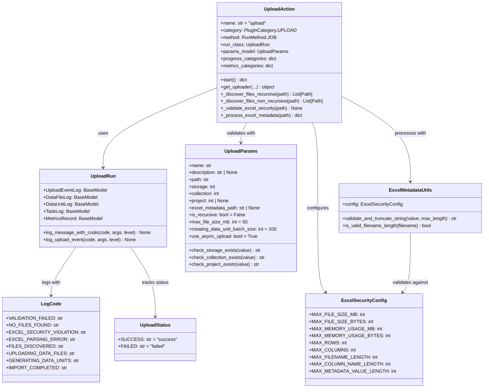
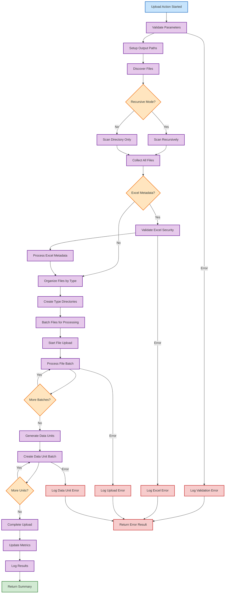

# Upload Plugins

Upload plugins provide file upload and data ingestion operations for processing files into the Synapse platform with comprehensive metadata support, security validation, and organized data unit generation.

## Overview

**Available Actions:**

- `upload` - Upload files and directories to storage with optional Excel metadata processing

**Use Cases:**

- Bulk file uploads with metadata annotation
- Excel-based metadata mapping and validation
- Recursive directory processing
- Type-based file organization
- Batch data unit creation
- Secure file processing with size and content validation

**Supported Upload Sources:**

- Local file system paths (files and directories)
- Recursive directory scanning
- Excel metadata files for enhanced file annotation
- Mixed file types with automatic organization

## Upload Action Architecture

The upload system uses a modular architecture with specialized components for different aspects of file processing:



### Upload Processing Flow

This flowchart shows the complete execution flow of upload operations:



## Upload Parameters

The upload action uses `UploadParams` for comprehensive parameter validation:

### Required Parameters

| Parameter    | Type  | Description                | Validation         |
| ------------ | ----- | -------------------------- | ------------------ |
| `name`       | `str` | Human-readable upload name | Must be non-blank  |
| `path`       | `str` | Source file/directory path | Must be valid path |
| `storage`    | `int` | Target storage ID          | Must exist via API |
| `collection` | `int` | Data collection ID         | Must exist via API |

### Optional Parameters

| Parameter                       | Type          | Default | Description                        |
| ------------------------------- | ------------- | ------- | ---------------------------------- |
| `description`                   | `str \| None` | `None`  | Upload description                 |
| `project`                       | `int \| None` | `None`  | Project ID (validated if provided) |
| `excel_metadata_path`           | `str \| None` | `None`  | Path to Excel metadata file        |
| `is_recursive`                  | `bool`        | `False` | Scan directories recursively       |
| `max_file_size_mb`              | `int`         | `50`    | Maximum file size in MB            |
| `creating_data_unit_batch_size` | `int`         | `100`   | Batch size for data units          |
| `use_async_upload`              | `bool`        | `True`  | Use asynchronous processing        |

### Parameter Validation

The system performs real-time validation:

```python
# Storage validation
@field_validator('storage', mode='before')
@classmethod
def check_storage_exists(cls, value: str, info) -> str:
    action = info.context['action']
    client = action.client
    try:
        client.get_storage(value)
    except ClientError:
        raise PydanticCustomError('client_error', 'Storage not found')
    return value
```

## Excel Metadata Processing

Upload plugins support Excel files for enhanced metadata annotation:

### Excel File Format

The Excel file should follow this structure:

| filename   | category | description        | custom_field |
| ---------- | -------- | ------------------ | ------------ |
| image1.jpg | nature   | Mountain landscape | high_res     |
| image2.png | urban    | City skyline       | processed    |

### Security Validation

Excel files undergo comprehensive security validation:

```python
class ExcelSecurityConfig:
    MAX_FILE_SIZE_MB = 10          # File size limit
    MAX_MEMORY_USAGE_MB = 30       # Memory usage limit
    MAX_ROWS = 10000               # Row count limit
    MAX_COLUMNS = 50               # Column count limit
    MAX_FILENAME_LENGTH = 255      # Filename length limit
    MAX_COLUMN_NAME_LENGTH = 100   # Column name length
    MAX_METADATA_VALUE_LENGTH = 1000  # Metadata value length
```

### Environment Configuration

Security limits can be configured via environment variables:

```bash
export EXCEL_MAX_FILE_SIZE_MB=20
export EXCEL_MAX_MEMORY_MB=50
export EXCEL_MAX_ROWS=20000
export EXCEL_MAX_COLUMNS=100
export EXCEL_MAX_FILENAME_LENGTH=500
export EXCEL_MAX_COLUMN_NAME_LENGTH=200
export EXCEL_MAX_METADATA_VALUE_LENGTH=2000
```

### Metadata Processing Flow

1. **Security Validation**: File size, memory estimation
2. **Format Validation**: Header structure, column count
3. **Content Processing**: Row-by-row metadata extraction
4. **Data Sanitization**: Length limits, string truncation
5. **Mapping Creation**: Filename to metadata mapping

## File Organization

The upload system automatically organizes files based on their types:

### Type Detection

Files are categorized based on:

- File extension patterns
- MIME type detection
- Content analysis
- Custom type rules

### Directory Structure

```
upload_output/
├── images/
│   ├── image1.jpg
│   └── image2.png
├── documents/
│   ├── report.pdf
│   └── data.xlsx
└── videos/
    └── presentation.mp4
```

### Batch Processing

Files are processed in configurable batches:

```python
# Configure batch size
params = {
    "creating_data_unit_batch_size": 100,
    "use_async_upload": True
}
```

## Progress Tracking and Metrics

### Progress Categories

The upload action tracks progress across three main phases:

| Category              | Proportion | Description                         |
| --------------------- | ---------- | ----------------------------------- |
| `analyze_collection`  | 2%         | Parameter validation and setup      |
| `upload_data_files`   | 38%        | File upload processing              |
| `generate_data_units` | 60%        | Data unit creation and finalization |

### Metrics Collection

Real-time metrics are collected for monitoring:

```python
metrics_categories = {
    'data_files': {
        'stand_by': 0,    # Files waiting to be processed
        'failed': 0,      # Files that failed upload
        'success': 0,     # Successfully uploaded files
    },
    'data_units': {
        'stand_by': 0,    # Units waiting to be created
        'failed': 0,      # Units that failed creation
        'success': 0,     # Successfully created units
    },
}
```

## Type-Safe Logging

The upload system uses enum-based logging for consistency:

### Log Codes

```python
class LogCode(str, Enum):
    VALIDATION_FAILED = 'VALIDATION_FAILED'
    NO_FILES_FOUND = 'NO_FILES_FOUND'
    EXCEL_SECURITY_VIOLATION = 'EXCEL_SECURITY_VIOLATION'
    EXCEL_PARSING_ERROR = 'EXCEL_PARSING_ERROR'
    FILES_DISCOVERED = 'FILES_DISCOVERED'
    UPLOADING_DATA_FILES = 'UPLOADING_DATA_FILES'
    GENERATING_DATA_UNITS = 'GENERATING_DATA_UNITS'
    IMPORT_COMPLETED = 'IMPORT_COMPLETED'
```

### Logging Usage

```python
# Basic logging
run.log_message_with_code(LogCode.FILES_DISCOVERED, file_count)

# With custom level
run.log_message_with_code(
    LogCode.EXCEL_SECURITY_VIOLATION,
    filename,
    level=Context.DANGER
)

# Upload-specific events
run.log_upload_event(LogCode.UPLOADING_DATA_FILES, batch_size)
```

## Usage Examples

### Basic File Upload

```python
from synapse_sdk.plugins.categories.upload.actions.upload import UploadAction

# Basic upload configuration
params = {
    "name": "Dataset Upload",
    "description": "Training dataset for ML model",
    "path": "/data/training_images",
    "storage": 1,
    "collection": 5,
    "is_recursive": True,
    "max_file_size_mb": 100
}

action = UploadAction(
    params=params,
    plugin_config=plugin_config
)

result = action.run_action()
print(f"Uploaded {result['uploaded_files_count']} files")
print(f"Created {result['generated_data_units_count']} data units")
```

### Excel Metadata Upload

```python
# Upload with Excel metadata
params = {
    "name": "Annotated Dataset Upload",
    "path": "/data/images",
    "storage": 1,
    "collection": 5,
    "excel_metadata_path": "/data/metadata.xlsx",
    "is_recursive": False,
    "creating_data_unit_batch_size": 50
}

action = UploadAction(
    params=params,
    plugin_config=plugin_config
)

result = action.run_action()
```

### Custom Configuration

```python
# Custom environment setup
import os

os.environ['EXCEL_MAX_FILE_SIZE_MB'] = '20'
os.environ['EXCEL_MAX_ROWS'] = '20000'

# Large file upload
params = {
    "name": "Large Dataset Upload",
    "path": "/data/large_dataset",
    "storage": 2,
    "collection": 10,
    "max_file_size_mb": 500,
    "creating_data_unit_batch_size": 200,
    "use_async_upload": True,
    "is_recursive": True
}

action = UploadAction(
    params=params,
    plugin_config=plugin_config,
    debug=True
)

result = action.run_action()
```

## Error Handling

### Exception Types

The upload system defines specific exceptions:

```python
# Security violations
try:
    action.run_action()
except ExcelSecurityError as e:
    print(f"Excel security violation: {e}")

# Parsing errors
except ExcelParsingError as e:
    print(f"Excel parsing failed: {e}")

# General upload errors
except ActionError as e:
    print(f"Upload action failed: {e}")
```

### Validation Errors

Parameter validation provides detailed error messages:

```python
from pydantic import ValidationError

try:
    params = UploadParams(**invalid_params)
except ValidationError as e:
    for error in e.errors():
        print(f"Field {error['loc']}: {error['msg']}")
```

## API Reference

### Main Classes

#### UploadAction

Main upload action class for file processing operations.

**Class Attributes:**

- `name = 'upload'` - Action identifier
- `category = PluginCategory.UPLOAD` - Plugin category
- `method = RunMethod.JOB` - Execution method
- `run_class = UploadRun` - Specialized run management
- `params_model = UploadParams` - Parameter validation model

**Key Methods:**

- `start()` - Main upload processing logic
- `get_uploader()` - Get configured uploader instance
- `_discover_files_recursive()` - Recursive file discovery
- `_process_excel_metadata()` - Excel metadata processing

#### UploadRun

Specialized run management for upload operations.

**Logging Methods:**

- `log_message_with_code(code, *args, level=None)` - Type-safe logging
- `log_upload_event(code, *args, level=None)` - Upload-specific events

**Nested Models:**

- `UploadEventLog` - Upload event logging
- `DataFileLog` - Data file processing logs
- `DataUnitLog` - Data unit creation logs
- `TaskLog` - Task execution logs
- `MetricsRecord` - Metrics tracking

#### UploadParams

Parameter validation model with Pydantic integration.

**Validation Features:**

- Real-time API validation for storage/collection/project
- String sanitization and length validation
- Type checking and conversion
- Custom validator methods

### Utility Classes

#### ExcelSecurityConfig

Security configuration for Excel file processing.

**Configuration Attributes:**

- File size and memory limits
- Row and column count limits
- String length restrictions
- Environment variable overrides

#### ExcelMetadataUtils

Utility methods for Excel metadata processing.

**Key Methods:**

- `validate_and_truncate_string()` - String sanitization
- `is_valid_filename_length()` - Filename validation

#### PathAwareJSONEncoder

Custom JSON encoder for Path and datetime objects.

**Supported Types:**

- Path objects (converts to string)
- Datetime objects (ISO format)
- Standard JSON-serializable types

### Enums

#### LogCode

Type-safe logging codes for upload operations.

**Categories:**

- Validation codes (VALIDATION_FAILED, STORAGE_VALIDATION_FAILED)
- File processing codes (NO_FILES_FOUND, FILES_DISCOVERED)
- Excel processing codes (EXCEL_SECURITY_VIOLATION, EXCEL_PARSING_ERROR)
- Progress codes (UPLOADING_DATA_FILES, GENERATING_DATA_UNITS)

#### UploadStatus

Upload processing status enumeration.

**Values:**

- `SUCCESS = 'success'` - Operation completed successfully
- `FAILED = 'failed'` - Operation failed with errors

### Exceptions

#### ExcelSecurityError

Raised when Excel files violate security constraints.

**Common Causes:**

- File size exceeds limits
- Memory usage estimation too high
- Content security violations

#### ExcelParsingError

Raised when Excel files cannot be parsed.

**Common Causes:**

- File format corruption
- Invalid Excel structure
- Missing required columns
- Content parsing failures

## Best Practices

### Performance Optimization

1. **Batch Processing**: Use appropriate batch sizes for large uploads
2. **Async Operations**: Enable async processing for better throughput
3. **Memory Management**: Configure Excel security limits appropriately
4. **Progress Monitoring**: Track progress categories for user feedback

### Security Considerations

1. **File Validation**: Always validate file sizes and types
2. **Excel Security**: Configure appropriate security limits
3. **Path Sanitization**: Validate and sanitize file paths
4. **Content Filtering**: Implement content-based security checks

### Error Handling

1. **Graceful Degradation**: Handle partial upload failures
2. **Detailed Logging**: Use LogCode enum for consistent logging
3. **User Feedback**: Provide clear error messages
4. **Recovery Options**: Implement retry mechanisms where appropriate

### Development Guidelines

1. **Modular Structure**: Follow the established modular pattern
2. **Type Safety**: Use Pydantic models and enum logging
3. **Testing**: Comprehensive unit test coverage
4. **Documentation**: Document custom validators and methods
