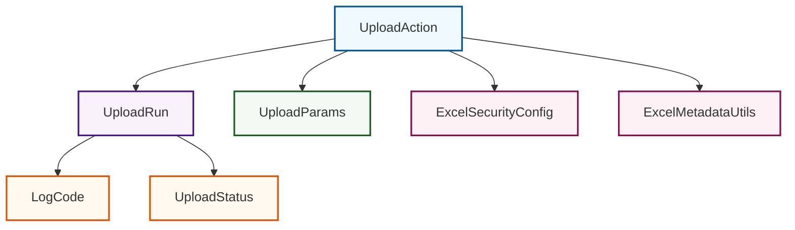
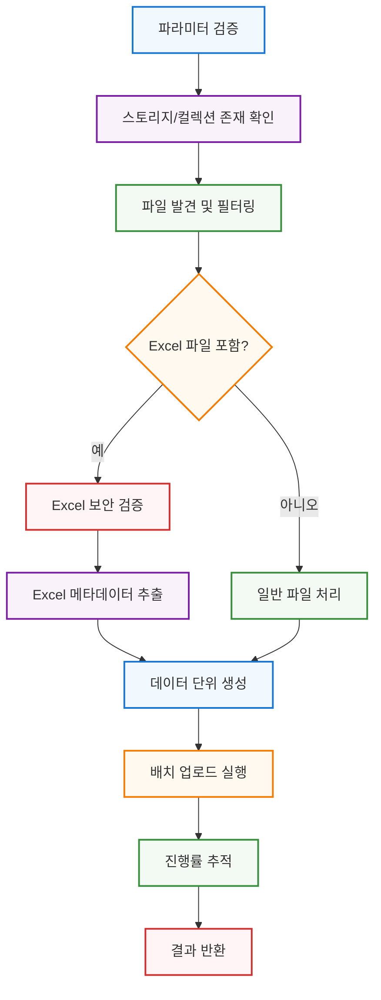
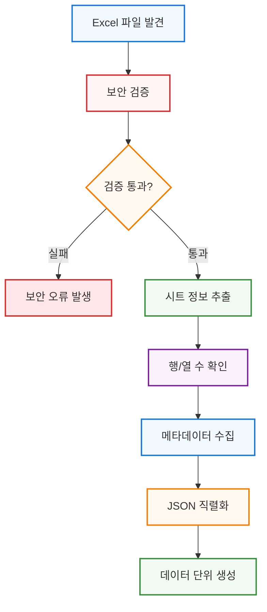

# 업로드 플러그인

업로드 플러그인은 다양한 데이터 소스에서 Synapse 데이터셋으로 파일을 업로드하기 위한 강력하고 유연한 시스템입니다. 로컬 파일, Excel 스프레드시트, 이미지 컬렉션을 위한 포괄적인 업로드 기능을 제공합니다.

## 개요

업로드 플러그인은 메타데이터 추출, 보안 검증, 진행률 추적을 포함하여 파일 업로드 과정의 모든 측면을 처리합니다. 대용량 파일 배치와 복잡한 디렉터리 구조를 효율적으로 관리하도록 설계되었습니다.

### 주요 기능

- **다중 파일 형식 지원**: Excel, 이미지, 텍스트 파일 등
- **메타데이터 추출**: Excel 파일에서 자동 메타데이터 수집
- **보안 검증**: 파일 액세스 제어 및 권한 검사
- **진행률 추적**: 실시간 업로드 진행률 모니터링
- **배치 처리**: 여러 파일의 효율적인 배치 업로드
- **분산 실행**: Ray를 사용한 확장 가능한 처리

## 아키텍처

업로드 플러그인은 각각 특정한 책임을 가진 여러 모듈로 구성되어 있습니다:



### 디렉터리 구조

```
synapse_sdk/
├── plugins/
│   └── categories/
│       └── upload/
│           └── actions/
│               └── upload/
│                   ├── __init__.py          # 공개 API 내보내기
│                   ├── action.py            # 주요 UploadAction 클래스
│                   ├── run.py              # UploadRun 클래스 및 실행 로직
│                   ├── models.py           # 매개변수 모델 및 검증
│                   ├── enums.py            # 열거형 및 상수
│                   ├── exceptions.py       # 사용자 정의 예외
│                   └── utils.py            # 유틸리티 클래스 및 헬퍼
```

## 업로드 액션 아키텍처

### 업로드 처리 흐름

업로드 플러그인은 다음과 같은 단계별 처리 흐름을 따릅니다:



이 처리 흐름은 견고성과 보안을 보장하면서 다양한 파일 유형에 대해 최적화된 성능을 제공합니다.

## 빠른 시작

### 기본 사용법

```python
from synapse_sdk.plugins.categories.upload.actions import upload

# 업로드 매개변수 정의
params = upload.UploadParams(
    source_path="/path/to/files",
    storage_id="your_storage_id",
    collection_id="your_collection_id",
    project_id="your_project_id"
)

# 업로드 액션 실행
action = upload.UploadAction(params=params)
result = action.run()

print(f"업로드 상태: {result.status}")
```

### Excel 파일 업로드

```python
from synapse_sdk.plugins.categories.upload.actions import upload

# Excel 파일에 대한 매개변수
params = upload.UploadParams(
    source_path="/path/to/excel/files",
    storage_id="storage123",
    collection_id="collection456",
    project_id="project789",
    excel_security_config={
        "check_macros": True,
        "check_external_links": True,
        "max_file_size": 50  # MB
    }
)

action = upload.UploadAction(params=params)
result = action.run()
```

### 진행률 모니터링

```python
import asyncio
from synapse_sdk.plugins.categories.upload.actions import upload

async def upload_with_progress():
    params = upload.UploadParams(
        source_path="/path/to/large/dataset",
        storage_id="storage123",
        collection_id="collection456",
        project_id="project789"
    )

    action = upload.UploadAction(params=params)

    # 진행률 콜백으로 업로드 실행
    result = await action.run_async(
        progress_callback=lambda progress: print(f"진행률: {progress}%")
    )

    return result

# 비동기 업로드 실행
result = asyncio.run(upload_with_progress())
```

## API 참조

### UploadAction

업로드 작업을 관리하는 주요 클래스입니다.

```python
class UploadAction:
    def __init__(self, params: UploadParams, run: Optional[UploadRun] = None):
        """
        업로드 액션을 초기화합니다.

        Args:
            params: 업로드 매개변수
            run: 선택적 실행 인스턴스
        """
```

#### 메서드

- `run() -> UploadResult`: 동기적으로 업로드를 실행합니다
- `run_async() -> UploadResult`: 비동기적으로 업로드를 실행합니다
- `validate_params() -> bool`: 업로드 매개변수를 검증합니다
- `discover_files() -> List[str]`: 업로드할 파일을 발견합니다
- `process_excel_metadata() -> Dict`: Excel 파일에서 메타데이터를 추출합니다

### UploadParams

업로드 구성을 위한 매개변수 모델입니다.

```python
class UploadParams(BaseModel):
    source_path: str
    storage_id: str
    collection_id: str
    project_id: str
    excel_security_config: Optional[ExcelSecurityConfig] = None
    batch_size: int = 100
    max_workers: int = 4
    include_patterns: Optional[List[str]] = None
    exclude_patterns: Optional[List[str]] = None
```

#### 필드

- **source_path**: 업로드할 파일의 소스 경로
- **storage_id**: 대상 스토리지 식별자
- **collection_id**: 대상 컬렉션 식별자
- **project_id**: 대상 프로젝트 식별자
- **excel_security_config**: Excel 보안 설정 (선택사항)
- **batch_size**: 배치 처리 크기 (기본값: 100)
- **max_workers**: 최대 작업자 수 (기본값: 4)
- **include_patterns**: 포함할 파일 패턴 (선택사항)
- **exclude_patterns**: 제외할 파일 패턴 (선택사항)

### 매개변수 검증

UploadParams는 Pydantic 모델을 사용하여 포괄적인 검증을 제공합니다:

```python
# 필수 매개변수 검증
params = upload.UploadParams(
    source_path="/valid/directory",  # 존재하는 디렉터리여야 함
    storage_id="storage_123",        # 비어있지 않은 문자열
    collection_id="collection_456",  # 비어있지 않은 문자열
    project_id="project_789"         # 비어있지 않은 문자열
)

# 스토리지 및 컬렉션 존재 검증
try:
    action = upload.UploadAction(params=params)
    result = action.run()
except ValidationError as e:
    print(f"매개변수 검증 실패: {e}")
```

**검증 규칙:**

- `source_path`: 읽기 가능한 디렉터리 또는 파일이어야 함
- 모든 ID 필드: 비어있지 않은 문자열이어야 함
- `batch_size`: 1 이상의 정수
- `max_workers`: 1 이상의 정수
- `include_patterns`/`exclude_patterns`: 유효한 glob 패턴 목록

### UploadRun

업로드 실행과 로깅을 관리합니다.

```python
class UploadRun(BaseRun):
    def __init__(self, action_name: str = "upload"):
        """업로드 실행을 초기화합니다."""

    def log_message_with_code(self, log_code: LogCode, **kwargs):
        """로그 코드를 사용하여 메시지를 로깅합니다."""

    def log_upload_event(self, event_type: str, details: Dict):
        """업로드 이벤트를 로깅합니다."""
```

### 열거형

#### LogCode

업로드 작업에 대한 타입 안전 로깅 코드:

```python
class LogCode(Enum):
    UPLOAD_STARTED = "UPLOAD_001"
    FILE_DISCOVERED = "UPLOAD_002"
    FILE_PROCESSED = "UPLOAD_003"
    BATCH_COMPLETED = "UPLOAD_004"
    UPLOAD_COMPLETED = "UPLOAD_005"
    UPLOAD_FAILED = "UPLOAD_006"
    # ... 총 36개 코드
```

#### UploadStatus

업로드 작업 상태:

```python
class UploadStatus(Enum):
    SUCCESS = "success"
    FAILED = "failed"
```

### 유틸리티 클래스

#### ExcelSecurityConfig

Excel 파일 보안 설정:

```python
class ExcelSecurityConfig:
    check_macros: bool = True
    check_external_links: bool = True
    max_file_size: int = 50  # MB
    allowed_extensions: List[str] = [".xlsx", ".xls"]
```

#### ExcelMetadataUtils

Excel 메타데이터 추출을 위한 유틸리티:

```python
class ExcelMetadataUtils:
    @staticmethod
    def extract_metadata(file_path: str) -> Dict:
        """Excel 파일에서 메타데이터를 추출합니다."""

    @staticmethod
    def get_sheet_info(file_path: str) -> List[Dict]:
        """Excel 시트 정보를 가져옵니다."""
```

#### PathAwareJSONEncoder

Path 및 datetime 객체를 위한 사용자 정의 JSON 인코더:

```python
class PathAwareJSONEncoder:
    """JSON 직렬화를 위한 사용자 정의 인코더"""

    @staticmethod
    def default(obj):
        """지원되는 타입을 JSON 호환 형식으로 변환"""
        if isinstance(obj, Path):
            return str(obj)
        elif isinstance(obj, datetime):
            return obj.isoformat()
        return json.JSONEncoder.default(obj)
```

**지원 타입:**

- Path 객체 (문자열로 변환)
- Datetime 객체 (ISO 형식)
- 표준 JSON 직렬화 가능 타입

## Excel 메타데이터 처리

### Excel 파일 형식

업로드 플러그인은 다음 Excel 형식을 지원합니다:

- **XLSX**: Office Open XML 형식 (권장)
- **XLS**: 레거시 Excel 형식 (제한적 지원)

### 보안 검증

Excel 파일에 대해 포괄적인 보안 검사를 수행합니다:

```python
# 보안 구성 예제
security_config = {
    "check_macros": True,           # 매크로 탐지
    "check_external_links": True,   # 외부 링크 탐지
    "max_file_size": 50,           # 최대 파일 크기 (MB)
    "max_memory_usage": 100,       # 최대 메모리 사용량 (MB)
    "max_rows": 1000000,           # 최대 행 수
    "max_columns": 16384,          # 최대 열 수
}
```

### 환경 구성

환경 변수를 통해 Excel 처리 설정을 재정의할 수 있습니다:

```bash
# 메모리 제한 설정
export EXCEL_MAX_MEMORY_MB=200

# 파일 크기 제한 설정
export EXCEL_MAX_FILE_SIZE_MB=100

# 행/열 제한 설정
export EXCEL_MAX_ROWS=500000
export EXCEL_MAX_COLUMNS=1000
```

### 메타데이터 처리 흐름



## 파일 구성

### 타입 탐지

업로드 플러그인은 파일 확장자와 MIME 타입을 기반으로 파일 유형을 자동 탐지합니다:

```python
# 지원되는 파일 유형
SUPPORTED_EXTENSIONS = {
    '.xlsx': 'Excel 워크북',
    '.xls': 'Excel 레거시',
    '.csv': 'CSV 파일',
    '.txt': '텍스트 파일',
    '.json': 'JSON 데이터',
    '.jpg': 'JPEG 이미지',
    '.png': 'PNG 이미지',
    '.pdf': 'PDF 문서'
}
```

### 디렉터리 구조

복잡한 디렉터리 구조를 효율적으로 처리합니다:

```
source_directory/
├── excel_files/
│   ├── data1.xlsx
│   └── data2.xlsx
├── images/
│   ├── photo1.jpg
│   └── photo2.png
└── documents/
    ├── report.pdf
    └── notes.txt
```

### 배치 처리

파일들을 효율적인 배치로 그룹화합니다:

- **유형별 그룹화**: 동일한 처리 로직을 사용하는 파일들을 함께 처리
- **크기 기반 분할**: 메모리 사용량을 제어하기 위해 큰 파일들을 별도로 처리
- **병렬 처리**: 독립적인 배치들을 동시에 처리

## 진행률 추적 및 메트릭

### 진행률 카테고리

업로드 과정에서 다음 진행률 카테고리를 추적합니다:

```python
# 진행률 카테고리
PROGRESS_CATEGORIES = {
    'file_discovery': '파일 발견',
    'validation': '검증',
    'excel_processing': 'Excel 처리',
    'metadata_extraction': '메타데이터 추출',
    'upload_preparation': '업로드 준비',
    'data_upload': '데이터 업로드',
    'finalization': '완료 처리'
}
```

### 메트릭 수집

상세한 성능 메트릭을 수집하여 분석에 활용할 수 있습니다:

```python
# 수집되는 메트릭
metrics = {
    "processing_time": {
        "file_discovery": 2.5,        # 초
        "excel_processing": 15.2,
        "upload": 45.8
    },
    "file_statistics": {
        "total_files": 150,
        "excel_files": 25,
        "image_files": 100,
        "other_files": 25
    },
    "data_volume": {
        "total_size_mb": 2048,
        "excel_data_mb": 512,
        "media_data_mb": 1536
    }
}
```

## 타입 안전 로깅

### 로그 코드

모든 로깅 작업에 타입 안전 코드를 사용합니다:

```python
# 검증 관련 로그 코드
VALIDATION_FAILED = "UPLOAD_001"
STORAGE_VALIDATION_FAILED = "UPLOAD_002"
COLLECTION_VALIDATION_FAILED = "UPLOAD_003"

# 파일 처리 관련 로그 코드
NO_FILES_FOUND = "UPLOAD_004"
FILES_DISCOVERED = "UPLOAD_005"
FILE_FILTERED = "UPLOAD_006"

# Excel 처리 관련 로그 코드
EXCEL_SECURITY_VIOLATION = "UPLOAD_010"
EXCEL_PARSING_ERROR = "UPLOAD_011"
EXCEL_METADATA_EXTRACTED = "UPLOAD_012"

# 진행률 관련 로그 코드
UPLOADING_DATA_FILES = "UPLOAD_020"
GENERATING_DATA_UNITS = "UPLOAD_021"
UPLOAD_PROGRESS = "UPLOAD_022"
```

### 로깅 사용법

구조화된 로깅으로 일관된 메시지 형식을 보장합니다:

```python
# 로그 메시지 예제
run.log_message_with_code(
    LogCode.FILES_DISCOVERED,
    file_count=25,
    directory=source_path
)
# 출력: [UPLOAD_005] INFO: 25개 파일 발견: /path/to/files
```

## 고급 사용법

### 사용자 정의 파일 필터링

```python
from synapse_sdk.plugins.categories.upload.actions import upload

params = upload.UploadParams(
    source_path="/path/to/mixed/files",
    storage_id="storage123",
    collection_id="collection456",
    project_id="project789",
    include_patterns=["*.xlsx", "*.jpg", "*.png"],
    exclude_patterns=["*temp*", "*backup*"]
)

action = upload.UploadAction(params=params)
result = action.run()
```

### 배치 크기 최적화

```python
# 대용량 파일에 대한 더 작은 배치 크기
params = upload.UploadParams(
    source_path="/path/to/large/files",
    storage_id="storage123",
    collection_id="collection456",
    project_id="project789",
    batch_size=50,  # 메모리 사용량 감소
    max_workers=2   # 리소스 사용량 감소
)
```

### Excel 보안 구성

```python
# 엄격한 보안 설정
excel_config = upload.ExcelSecurityConfig(
    check_macros=True,
    check_external_links=True,
    max_file_size=25,  # 25MB 제한
    allowed_extensions=[".xlsx"]  # .xls 파일 제외
)

params = upload.UploadParams(
    source_path="/path/to/excel/files",
    storage_id="storage123",
    collection_id="collection456",
    project_id="project789",
    excel_security_config=excel_config
)
```

## 오류 처리

업로드 플러그인은 다양한 오류 상황에 대한 포괄적인 오류 처리를 제공합니다:

### 일반적인 예외

```python
from synapse_sdk.plugins.categories.upload.actions import upload

try:
    params = upload.UploadParams(
        source_path="/invalid/path",
        storage_id="storage123",
        collection_id="collection456",
        project_id="project789"
    )

    action = upload.UploadAction(params=params)
    result = action.run()

except upload.UploadValidationError as e:
    print(f"검증 오류: {e}")
except upload.UploadExecutionError as e:
    print(f"실행 오류: {e}")
except upload.UploadSecurityError as e:
    print(f"보안 오류: {e}")
except upload.ExcelParsingError as e:
    print(f"Excel 파싱 오류: {e}")
```

### 예외 타입

#### ExcelSecurityError

Excel 파일이 보안 제약 조건을 위반할 때 발생합니다.

**일반적인 원인:**

- 파일 크기가 제한을 초과
- 메모리 사용량 추정치가 너무 높음
- 콘텐츠 보안 위반

#### ExcelParsingError

Excel 파일을 파싱할 수 없을 때 발생합니다.

**일반적인 원인:**

- 파일 형식 손상
- 잘못된 Excel 구조
- 필수 열 누락
- 콘텐츠 파싱 실패

### 부분 실패 처리

```python
result = action.run()

if result.status == upload.UploadStatus.FAILED:
    print(f"실패한 파일: {result.failed_files}")
    print(f"성공한 파일: {result.successful_files}")

    # 실패한 파일만 재시도
    retry_params = upload.UploadParams(
        source_path=result.failed_files,
        storage_id=params.storage_id,
        collection_id=params.collection_id,
        project_id=params.project_id
    )
```

## 성능 고려사항

### 메모리 사용량

- 대용량 Excel 파일의 경우 더 작은 `batch_size` 사용
- 메모리 집약적인 작업을 위해 `max_workers` 제한
- 스트리밍 처리를 위해 청크 업로드 사용

### 네트워크 최적화

- 네트워크 지연 시간이 높은 환경에서 배치 크기 증가
- 신뢰할 수 없는 연결에 대해 재시도 메커니즘 구현
- 대용량 파일에 대해 체크섬 검증 사용

### 병렬 처리

```python
# Ray를 사용한 분산 처리
params = upload.UploadParams(
    source_path="/path/to/massive/dataset",
    storage_id="storage123",
    collection_id="collection456",
    project_id="project789",
    execution_method="ray",  # Ray 클러스터 사용
    max_workers=10
)
```

## 로깅 및 모니터링

### 로그 코드 사용

업로드 플러그인은 모든 작업에 대해 구조화된 로깅을 제공합니다:

```python
from synapse_sdk.plugins.categories.upload.actions import upload

# 사용자 정의 로깅 핸들러
def custom_log_handler(log_code: upload.LogCode, message: str, level: str):
    print(f"[{log_code.value}] {level}: {message}")

# 로그 핸들러와 함께 액션 실행
action = upload.UploadAction(params=params)
action.run.add_log_handler(custom_log_handler)
result = action.run()
```

### 메트릭 수집

```python
# 업로드 메트릭 수집
result = action.run()

metrics = {
    "total_files": result.total_files,
    "successful_files": len(result.successful_files),
    "failed_files": len(result.failed_files),
    "total_size": result.total_size_bytes,
    "duration": result.duration_seconds,
    "throughput": result.total_size_bytes / result.duration_seconds
}

print(f"업로드 메트릭: {metrics}")
```

## 테스팅

업로드 플러그인에는 포괄적인 테스트 스위트가 포함되어 있습니다:

### 단위 테스트 실행

```bash
# 모든 업로드 테스트 실행
python -m pytest tests/plugins/upload/ -v

# 특정 테스트 파일 실행
python -m pytest tests/plugins/upload/test_action.py -v

# 커버리지와 함께 테스트 실행
python -m pytest tests/plugins/upload/ --cov=synapse_sdk.plugins.categories.upload
```

### 테스트 케이스 예제

```python
import pytest
from synapse_sdk.plugins.categories.upload.actions import upload

def test_upload_params_validation():
    """업로드 매개변수 검증을 테스트합니다."""
    # 유효한 매개변수
    params = upload.UploadParams(
        source_path="/valid/path",
        storage_id="storage123",
        collection_id="collection456",
        project_id="project789"
    )
    assert params.source_path == "/valid/path"

    # 무효한 매개변수
    with pytest.raises(ValidationError):
        upload.UploadParams(
            source_path="",  # 빈 경로
            storage_id="storage123",
            collection_id="collection456",
            project_id="project789"
        )
```

## 문제 해결

### 일반적인 문제

#### 1. 권한 오류

```
UploadSecurityError: Access denied to source path
```

**해결책**: 소스 디렉터리와 대상 스토리지에 대한 적절한 권한이 있는지 확인하세요.

#### 2. Excel 파일 처리 실패

```
UploadExecutionError: Failed to process Excel file - corrupted or protected
```

**해결책**:

- Excel 파일이 손상되지 않았는지 확인
- 암호로 보호된 파일에 대한 올바른 자격 증명 제공
- Excel 보안 구성 검토

#### 3. 메모리 부족 오류

```
MemoryError: Unable to allocate array
```

**해결책**:

- 배치 크기 줄이기 (`batch_size` 매개변수)
- 최대 작업자 수 제한 (`max_workers` 매개변수)
- 대용량 파일에 대해 스트리밍 업로드 사용

### 디버그 모드

```python
import logging

# 디버그 로깅 활성화
logging.basicConfig(level=logging.DEBUG)

# 상세한 로깅과 함께 업로드 실행
params = upload.UploadParams(
    source_path="/path/to/files",
    storage_id="storage123",
    collection_id="collection456",
    project_id="project789",
    debug_mode=True  # 상세한 로깅 활성화
)

result = action.run()
```

## 기여하기

업로드 플러그인 개발에 기여하려면:

1. 개발 환경 설정:

   ```bash
   git clone <repository-url>
   cd synapse-sdk
   pip install -e ".[dev]"
   ```

2. 테스트 실행:

   ```bash
   python -m pytest tests/plugins/upload/ -v
   ```

3. 코드 스타일 확인:

   ```bash
   black synapse_sdk/plugins/categories/upload/
   flake8 synapse_sdk/plugins/categories/upload/
   ```

4. 새로운 기능 또는 버그 수정을 위한 풀 리퀘스트 생성

### 개발 지침

- 모든 새로운 기능에 대해 테스트 작성
- 공개 API에 대한 docstring 업데이트
- 타입 힌트 사용으로 코드 안전성 보장
- 기존 로깅 패턴 및 LogCode 열거형 따르기

## 모범 사례

### 성능 최적화

1. **배치 처리**: 대용량 업로드를 위해 적절한 배치 크기 사용
2. **비동기 작업**: 더 나은 처리량을 위해 비동기 처리 활성화
3. **메모리 관리**: Excel 보안 제한을 적절히 구성
4. **진행률 모니터링**: 사용자 피드백을 위한 진행률 카테고리 추적

### 보안 고려사항

1. **파일 검증**: 항상 파일 크기와 유형 검증
2. **Excel 보안**: 적절한 보안 제한 구성
3. **경로 삭제**: 파일 경로 검증 및 삭제
4. **콘텐츠 필터링**: 콘텐츠 기반 보안 검사 구현

### 오류 처리

1. **우아한 저하**: 부분 업로드 실패 처리
2. **상세한 로깅**: 일관된 로깅을 위해 LogCode 열거형 사용
3. **사용자 피드백**: 명확한 오류 메시지 제공
4. **복구 옵션**: 적절한 재시도 메커니즘 구현

### 개발 지침

1. **모듈 구조**: 확립된 모듈 패턴 따르기
2. **타입 안전성**: Pydantic 모델 및 열거형 로깅 사용
3. **테스팅**: 포괄적인 단위 테스트 커버리지
4. **문서화**: 사용자 정의 검증자와 메서드 문서화

## 라이센스

이 플러그인은 Synapse SDK와 동일한 라이센스 하에 배포됩니다.
