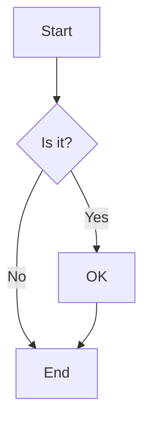
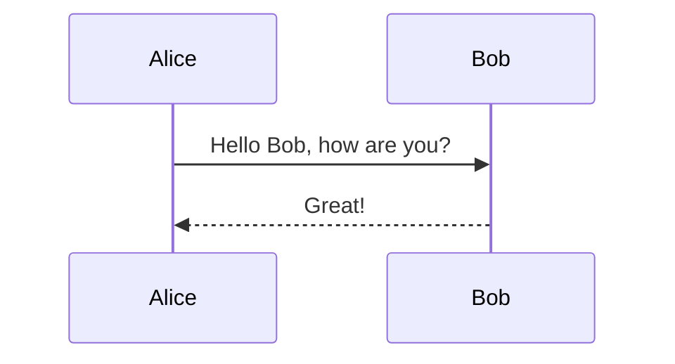

# Mermaid Diagram Support

This document provides information about using Mermaid diagrams with sys-design-diagram.

## Overview

The sys-design-diagram package now supports Mermaid diagrams (`.mmd` files) alongside PlantUML (`.puml`) and diagrams library (`.py`) files.

## Prerequisites

For full Mermaid functionality, you need:

1. **Node.js** (v14 or later)
2. **Mermaid CLI**: Install with `npm install -g @mermaid-js/mermaid-cli`
3. **Chrome/Chromium browser** or equivalent for rendering

## Installation

```bash
# Install Node.js (if not already installed)
# On Ubuntu/Debian:
curl -fsSL https://deb.nodesource.com/setup_lts.x | sudo -E bash -
sudo apt-get install -y nodejs

# Install Mermaid CLI
npm install -g @mermaid-js/mermaid-cli

# Install Chrome (if not already installed)
sudo apt-get install -y chromium-browser
```

## Usage

### Processing Mermaid Files Only

```bash
sys-design-diagram mermaid -d designs/ -o output/
```

### Processing All Diagram Types

```bash
sys-design-diagram process-all -d designs/ -o output/
```

This command will process:
- PlantUML files (*.puml)
- Python diagram files (*.py)
- Mermaid files (*.mmd)

## Mermaid File Examples

### Flowchart


### Sequence Diagram


### Git Graph
```mermaid
gitgraph
    commit
    commit
    branch develop
    checkout develop
    commit
    commit
    checkout main
    merge develop
```

## Fallback Mode

When Chrome is not available (e.g., in CI environments), the system automatically creates placeholder files containing the original Mermaid content. This ensures the workflow continues without breaking.

## Directory Structure

```
designs/
├── design1/
│   ├── component1.puml
│   ├── architecture.py
│   └── flow.mmd          # Mermaid diagram
└── design2/
    ├── sequence.mmd      # Mermaid diagram
    └── overview.puml
```

## Output

Generated diagrams are saved as PNG files:

```
output/
├── design1/
│   ├── component1.png
│   ├── architecture.png
│   └── flow.png          # Generated from flow.mmd
└── design2/
    ├── sequence.png      # Generated from sequence.mmd
    └── overview.png
```

## Troubleshooting

### Chrome Not Found Error

If you see errors about Chrome not being found:

1. Install Chrome/Chromium: `sudo apt-get install chromium-browser`
2. Or install via snap: `sudo snap install chromium`
3. For headless environments, consider using the fallback mode

### Mermaid CLI Not Found

If `mmdc` command is not found:

1. Install Node.js
2. Install Mermaid CLI: `npm install -g @mermaid-js/mermaid-cli`
3. Ensure npm global bin is in your PATH

### CI/CD Environments

For CI/CD pipelines, you may want to use the fallback mode intentionally. The system will:

1. Detect when Chrome is unavailable
2. Create placeholder files with the original Mermaid content
3. Log warnings but continue processing
4. Allow the pipeline to complete successfully