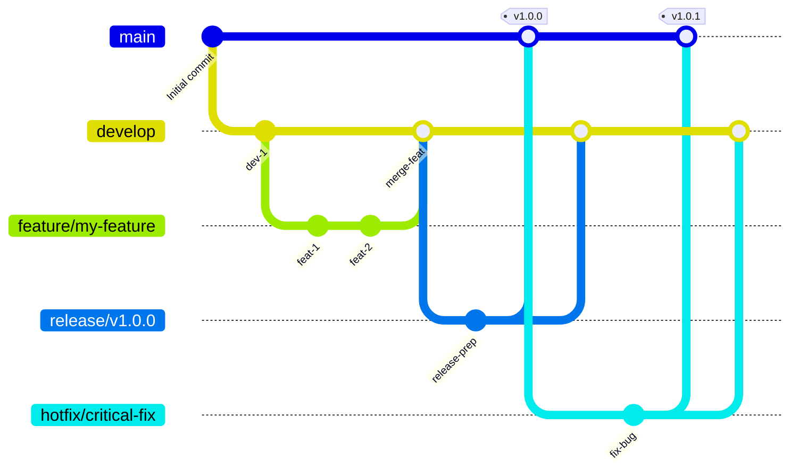

# GitFlow ブランチ戦略 (日本語説明)

このドキュメントでは、`tree-sitter-analyzer`プロジェクトで実装されているGitFlowブランチ戦略を、Mermaidチャートと日本語で解説します。

## GitFlow フロー図



## ブランチ構造

### 主要ブランチ

- **`main`**: 本番環境に対応したコード。常に最新の安定版リリースが含まれます。いつでもデプロイ可能な状態であるべきです。
- **`develop`**: 機能統合用のブランチ。最新の開発変更が含まれており、すべての機能開発の起点となります。

### サポートブランチ

- **`feature/*`**: 機能開発用のブランチ。
    - **派生元**: `develop`
    - **マージ先**: `develop`
    - **命名規則**: `feature/descriptive-name` (例: `feature/user-authentication`)
- **`release/*`**: リリース準備用のブランチ。新しい本番リリースの準備に使用され、軽微なバグ修正やドキュメント生成など、リリースに関連するタスクのみを行います。
    - **派生元**: `develop`
    - **マージ先**: `main` と `develop`
    - **命名規則**: `release/v1.2.0`
- **`hotfix/*`**: 緊急の本番バグ修正用のブランチ。本番環境での重大な問題を迅速に修正するために使用されます。
    - **派生元**: `main`
    - **マージ先**: `main` と `develop`
    - **命名規則**: `hotfix/critical-bug-fix`

## ワークフロー

### 1. 機能開発 (Feature Development)

1.  **`develop` から `feature` ブランチを作成**:
    ```bash
    git checkout develop
    git pull origin develop
    git checkout -b feature/your-feature-name
    ```
2.  **機能開発を行い**、定期的にコミットします。
3.  **開発完了後**、`feature` ブランチをリモートにプッシュし、`develop` ブランチへのプルリクエストを作成します。
4.  コードレビューと継続的インテグレーション（CI）のチェックを通過後、**`develop` にマージ**します。

### 2. リリースプロセス (Release Process)

プロジェクトでは自動化されたリリースプロセスを推奨していますが、手動のプロセスは以下の通りです。

1.  **`develop` から `release` ブランチを作成**:
    ```bash
    git checkout -b release/v1.0.0 develop
    ```
2.  **リリース準備**: バージョン番号の更新、ドキュメントの生成など。
    ```bash
    # pyproject.toml のバージョン番号を更新
    # server_version を更新
    # __init__.py にバージョン番号を同期
    uv run python scripts/sync_version_minimal.py

    # ドキュメントの更新：
    # - README.md のバージョン番号、テスト数、カバレッジを更新
    # - バージョンバッジ、テストバッジ、カバレッジバッジを更新
    # - "最新の品質成果"セクションのバージョン参照を更新
    # - テスト環境セクションのバージョン参照を更新
    # - ドキュメント全体の他のバージョン言及を更新
    # - README_zh.md と README_ja.md の翻訳版を更新
    # - ワークフローに変更があった場合、GITFLOW_zh.md と GITFLOW_ja.md を更新
    # - CHANGELOG.md にリリース詳細を更新
    ```
3.  **準備完了後、`main` と `develop` にマージ**:
    ```bash
    # mainブランチに切り替えてマージ
    git checkout main
    git merge release/v1.0.0
    git tag -a v1.0.0 -m "Release v1.0.0" # バージョンタグを付与
    git push origin main --tags

    # developブランチに切り替えてマージ
    git checkout develop
    git merge release/v1.0.0
    git push origin develop
    ```
4.  **`release` ブランチを削除**します。

### 3. 緊急修正 (Hotfix Process)

1.  **`main` から `hotfix` ブランチを作成**:
    ```bash
    git checkout -b hotfix/critical-bug-fix main
    ```
2.  **バグを修正**し、コミットします。
3.  **バージョンとドキュメントの更新**:
    ```bash
    # pyproject.toml のバージョン番号を更新 (例: 1.0.0 -> 1.0.1)
    # server_version を更新
    # __init__.py にバージョン番号を同期
    uv run python scripts/sync_version_minimal.py

    # ドキュメントの更新：
    # - CHANGELOG.md にホットフィックス詳細を更新
    # - README.md のバージョン番号、テスト数、カバレッジを更新
    # - バージョンバッジ、テストバッジ、カバレッジバッジを更新
    # - "最新の品質成果"セクションのバージョン参照を更新
    # - テスト環境セクションのバージョン参照を更新
    # - ドキュメント全体の他のバージョン言及を更新
    # - README_zh.md と README_ja.md の翻訳版を更新
    # - ワークフローに変更があった場合、GITFLOW_zh.md と GITFLOW_ja.md を更新
    ```
4.  **修正完了後、`main` と `develop` にマージ**:
    ```bash
    # mainブランチに切り替えてマージ
    git checkout main
    git merge hotfix/critical-bug-fix
    git tag -a v1.0.1 -m "Hotfix v1.0.1" # 修正バージョンタグを付与
    git push origin main --tags

    # developブランチに切り替えてマージ
    git checkout develop
    git merge hotfix/critical-bug-fix
    git push origin develop
    ```
5.  **`hotfix` ブランチを削除**します。

---

*この日本語説明は、[`GITFLOW.md`](GITFLOW.md) の中核的な概念を理解するのに役立ちます。自動化プロセス、品質チェック、CI/CD統合に関する詳細は、元のドキュメントを参照してください。*
