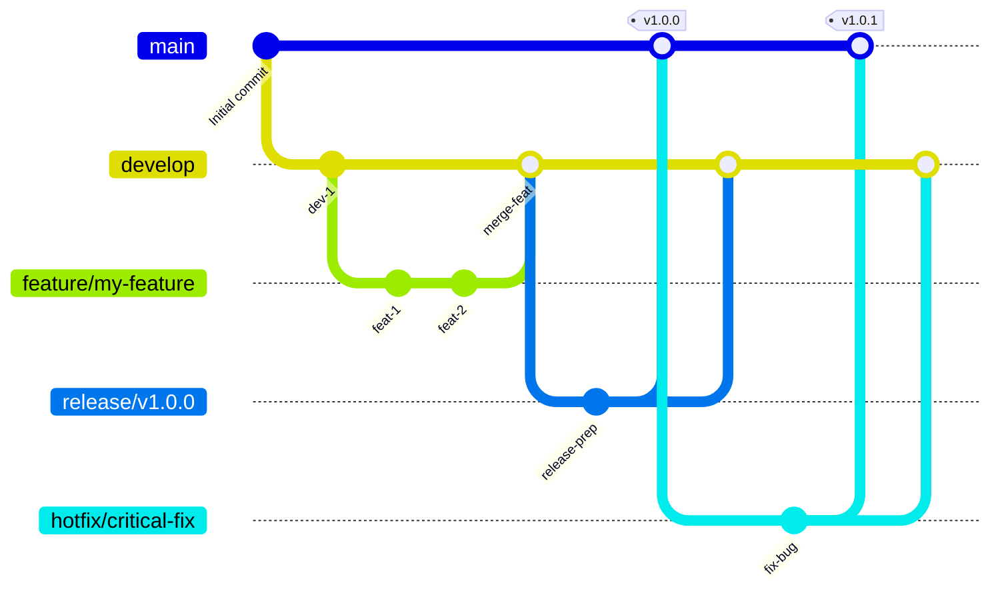

# GitFlow 分支策略 (中文说明)

本文档使用 Mermaid 图表和中文解释了 `tree-sitter-analyzer` 项目中实施的 GitFlow 分支策略。

## GitFlow 流程图



## 分支结构

### 主要分支

- **`main`**: 生产就绪的代码。始终包含最新的稳定版本。任何时候都应该是可部署的状态。
- **`develop`**: 功能集成分支。包含最新的已交付开发变更，是所有功能开发的起点。

### 支持分支

- **`feature/*`**: 功能开发分支。
    - **来源**: `develop`
    - **合并回**: `develop`
    - **命名**: `feature/descriptive-name` (例如: `feature/user-authentication`)
- **`release/*`**: 版本发布准备分支。用于准备新的生产版本，只进行少量 Bug 修复和文档生成等面向发布的任务。
    - **来源**: `develop`
    - **合并回**: `main` 和 `develop`
    - **命名**: `release/v1.2.0`
- **`hotfix/*`**: 紧急生产 Bug 修复分支。用于快速修复生产环境中的关键问题。
    - **来源**: `main`
    - **合并回**: `main` 和 `develop`
    - **命名**: `hotfix/critical-bug-fix`

## 工作流程

### 1. 功能开发 (Feature Development)

1.  **从 `develop` 创建 `feature` 分支**:
    ```bash
    git checkout develop
    git pull origin develop
    git checkout -b feature/your-feature-name
    ```
2.  **进行功能开发**并定期提交。
3.  **开发完成后**，将 `feature` 分支推送到远程，并创建拉取请求 (Pull Request) 到 `develop` 分支。
4.  经过代码审查和持续集成 (CI) 检查通过后，**合并到 `develop`**。

### 2. 版本发布 (Release Process)

项目推荐使用自动化发布流程，但手动流程如下：

1.  **从 `develop` 创建 `release` 分支**:
    ```bash
    git checkout -b release/v1.0.0 develop
    ```
2.  **准备发布**: 更新版本号、生成文档等。
    ```bash
    # 更新 pyproject.toml 中的版本号
    # 更新 server_version
    # 同步版本号到 __init__.py
    uv run python scripts/sync_version_minimal.py

    # 更新文档：
    # - 更新 README.md 中的版本号、测试数量和覆盖率
    # - 更新版本徽章、测试徽章、覆盖率徽章
    # - 更新"最新质量成就"部分的版本引用
    # - 更新测试环境部分的版本引用
    # - 更新文档中的所有其他版本引用
    # - 更新 README_zh.md 和 README_ja.md 翻译版本
    # - 如有工作流更改，更新 GITFLOW_zh.md 和 GITFLOW_ja.md
    # - 更新 CHANGELOG.md 发布详情
    ```
3.  **完成准备后，合并到 `main` 和 `develop`**:
    ```bash
    # 切换到 main 分支并合并
    git checkout main
    git merge release/v1.0.0
    git tag -a v1.0.0 -m "Release v1.0.0" # 打上版本标签
    git push origin main --tags

    # 切换到 develop 分支并合并
    git checkout develop
    git merge release/v1.0.0
    git push origin develop
    ```
4.  **删除 `release` 分支**。

### 3. 紧急修复 (Hotfix Process)

1.  **从 `main` 创建 `hotfix` 分支**:
    ```bash
    git checkout -b hotfix/critical-bug-fix main
    ```
2.  **修复 Bug** 并提交。
3.  **更新版本和文档**:
    ```bash
    # 更新 pyproject.toml 版本号 (例如: 1.0.0 -> 1.0.1)
    # 更新 server_version
    # 同步版本号到 __init__.py
    uv run python scripts/sync_version_minimal.py

    # 更新文档：
    # - 更新 CHANGELOG.md 添加 hotfix 详情
    # - 更新 README.md 中的版本号、测试数量和覆盖率
    # - 更新版本徽章、测试徽章、覆盖率徽章
    # - 更新"最新质量成就"部分的版本引用
    # - 更新测试环境部分的版本引用
    # - 更新文档中的所有其他版本引用
    # - 更新 README_zh.md 和 README_ja.md 翻译版本
    # - 如有工作流更改，更新 GITFLOW_zh.md 和 GITFLOW_ja.md
    ```
4.  **完成修复后，合并到 `main` 和 `develop`**:
    ```bash
    # 切换到 main 分支并合并
    git checkout main
    git merge hotfix/critical-bug-fix
    git tag -a v1.0.1 -m "Hotfix v1.0.1" # 打上修复版本标签
    git push origin main --tags

    # 切换到 develop 分支并合并
    git checkout develop
    git merge hotfix/critical-bug-fix
    git push origin develop
    ```
5.  **删除 `hotfix` 分支**。

---

*此中文说明旨在帮助理解 `GITFLOW.md` 中的核心概念。更详细的自动化流程、质量检查和 CI/CD 集成信息，请参阅原始的 [GITFLOW.md](GITFLOW.md) 文件。*
