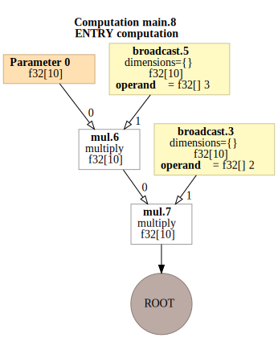
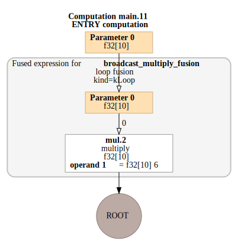

# Examples

This section demonstrates visu-hlo capabilities with real examples showing the HLO visualization differences between regular and jitted functions.

## Basic Function Example

Here's the example from the main docstring showing how visu-hlo visualizes the difference between regular and jitted functions:

```python
import jax.numpy as jnp
from jax import jit
from visu_hlo import show

def func(x):
    return 3 * x * 2

# Display HLO for original function
show(func, jnp.ones(10))

# Display HLO for jitted function
show(jit(func), jnp.ones(10))
```

### Original Function HLO

The non-jitted function shows the computation graph as JAX would compile it:



### Jitted Function HLO

The jitted function shows the optimized computation graph after JIT compilation:



## Key Differences

When comparing the two visualizations:

1. **Optimization**: The jitted version may show fused operations
2. **Constant Folding**: Constants like `3 * 2 = 6` may be pre-computed
3. **Memory Layout**: Different memory access patterns may be visible
4. **Operation Count**: Fewer nodes in the optimized version

## More Examples

```{toctree}
:maxdepth: 1

matrix_operations
control_flow
transformations
```
