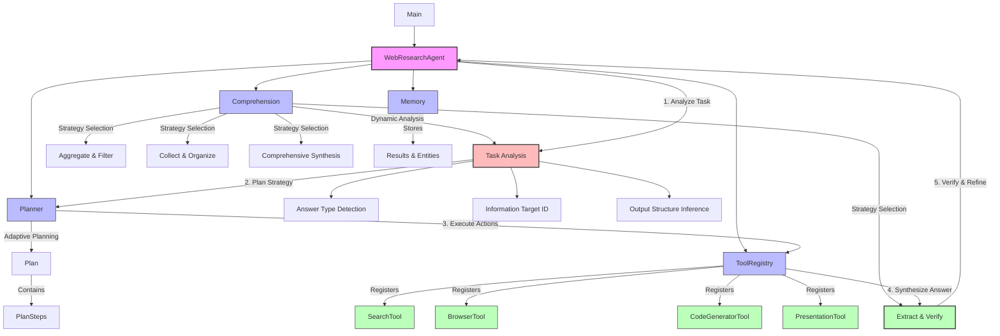

# Web Research Agent

A research implementation of the ReAct (Reasoning + Acting) paradigm for web research. The system analyzes a task, plans concrete tool actions, executes them (search, browse, optional code), and synthesizes an answer with sources and basic verification. The design is task-agnostic: no topic-specific heuristics are required to operate across different questions.

> This repository is intended for studying structured approaches to web research and evaluation. It is not a production system.

## Research Contributions

- Task-agnostic analysis of question structure to select a synthesis strategy without topic-specific rules
- Adaptive planning that produces actionable steps over registered tools (search, browser, present, optional code)
- Multi-strategy synthesis (extract-and-verify, aggregate-and-filter, collect-and-organize, comprehensive-synthesis)
- Robust parameter and URL handling with snippet fallback when pages cannot be fetched
- Source attribution and lightweight cross-source verification

## Features

- Task-Adaptive Reasoning: infers expected answer type (factual lookup, list, comparison, narrative) from the task text
- Planning and Tool Use: generates steps that call SearchTool, BrowserTool, and PresentationTool with validated parameters
- Content Extraction: prefers main content from web pages; falls back to search snippets when needed
- Verification: groups paraphrases and scores support by distinct domains (extract-and-verify strategy)
- Structured Output: formats results deterministically for the requested answer type
- Configuration and Logging: configurable limits and detailed logs for analysis and evaluation

## Task-Agnostic Design

- No topic-specific filters or keywords are required for operation
- Requested list size is inferred from the task text (e.g., “10 statements”), not hardcoded
- De-duplication is based on content similarity and source/date keys, not hand-written topic rules
- Statement/quote extraction uses generic patterns (quotes and sentence heuristics)
- Verification relies on cross-source/domain support rather than task-specific logic

## Tool Interfaces

- SearchTool: returns a list of results (title, link, snippet)
- BrowserTool: fetches a URL and extracts main content or full page; can aggregate search snippets if a URL is not available
- PresentationTool: assembles the final answer for the chosen strategy
- CodeGeneratorTool: optional, for tasks that require computation (e.g., filtering or plotting)

See implementation: agent/agent.py, agent/planner.py, tools/search.py, tools/browser.py, tools/presentation_tool.py.

## Execution Flow

1. Analyze the task to determine answer type and information targets
2. Create a plan: search → browse (one or more pages) → present (optionally code when needed)
3. Execute tools with parameter and URL resolution; use snippet fallback as needed
4. Synthesize the answer using one of four strategies; attribute sources and verify where applicable

## Architecture & ReAct Implementation

This project implements the ReAct paradigm with dynamic task analysis and adaptive synthesis:



### Workflow Explanation

The diagram above illustrates how the Web Research Agent processes research tasks:

1. **Task Analysis Phase**:
   - When a user submits a research question, the system first analyzes the task structure
   - The Comprehension component uses pattern recognition to detect answer types (factual, comparative, list-based, etc.)
   - It identifies specific information targets needed to answer the question
   - It determines the appropriate output structure for the anticipated answer

2. **Planning Phase**:
   - Based on the task analysis, the Planner creates a series of search strategies
   - It generates concrete plan steps targeting the identified information needs
   - Each plan step specifies what information to retrieve and how to process it

3. **Action Phase**:
   - The ToolRegistry orchestrates the execution of research tools:
     - SearchTool finds relevant information sources
     - BrowserTool extracts content from web pages
     - CodeGeneratorTool creates analysis scripts when needed
     - PresentationTool formats findings appropriately

4. **Synthesis Phase**:
   - Based on the question type, one of four synthesis strategies is selected:
     - Extract-and-Verify for factual questions
     - Aggregate-and-Filter for comparative analyses
     - Collect-and-Organize for list-building tasks
     - Comprehensive-Synthesis for complex, multi-faceted questions
   - The Memory component provides context by storing intermediate findings and entities

5. **Refinement Loop**:
   - If the synthesized answer is incomplete, the system may return to planning
   - This iterative process continues until a satisfactory answer is produced
   - The final output is tailored to directly address the specific question asked

This research implementation demonstrates how a structured approach to web research can adapt to different question types without relying on hardcoded rules.

## Installation

### Prerequisites

- Python 3.9 or higher
- pip (Python package installer)

### Setup

1. Clone the repository:

   ```bash
   git clone https://github.com/ashioyajotham/web_research_agent.git
   cd web_research_agent
   ```

2. Create a virtual environment:

   ```bash
   python -m venv venv
   source venv/bin/activate  # On Windows: venv\Scripts\activate
   ```

3. Install dependencies:

   ```bash
   pip install -r requirements.txt
   ```

## Research Environment Setup

The system requires the following external services for operation:

1. **Gemini API**: Language model for reasoning and synthesis
2. **Serper API**: Web search results for information gathering

### Setting up API keys

#### Option 1: .env file (Recommended for research)

Create a `.env` file in the project root:

```bash
GEMINI_API_KEY=your_gemini_api_key
SERPER_API_KEY=your_serper_api_key
```

#### Option 2: Environment Variables

```bash
export GEMINI_API_KEY=your_gemini_api_key
export SERPER_API_KEY=your_serper_api_key
```

#### Option 3: Programmatic Configuration

```python
from config.config_manager import init_config

config = init_config()
config.update('gemini_api_key', 'your_gemini_api_key')
config.update('serper_api_key', 'your_serper_api_key')
```

### Research Configuration Parameters

These parameters control the system's behavior and can be modified for experimental purposes:

| Parameter | Environment Variable | Description | Default |
|-----------|---------------------|-------------|---------|
| gemini_api_key | GEMINI_API_KEY | API key for Gemini LLM | - |
| serper_api_key | SERPER_API_KEY | API key for Serper.dev search | - |
| log_level | LOG_LEVEL | Logging detail level | INFO |
| max_search_results | MAX_SEARCH_RESULTS | Search results to process | 5 |
| memory_limit | MEMORY_LIMIT | Working memory capacity | 100 |
| output_format | OUTPUT_FORMAT | Results format (markdown, text, html) | markdown |
| timeout | REQUEST_TIMEOUT | Web request timeout (seconds) | 30 |

## Usage

### Basic Research Tasks

1. Create a text file with research questions:

   ```txt
   # tasks.txt
   Find the name of the COO of the organization that mediated talks between US and Chinese AI companies in Geneva in 2023.
     By what percentage did Volkswagen reduce their Scope 1 and Scope 2 greenhouse gas emissions in 2023 compared to 2021?
   ```

   Note: Empty lines between tasks help the system distinguish between separate questions.

2. Run the research process:

   ```bash
   python main.py tasks.txt
   ```

3. Results will be saved to the `results/` directory as Markdown files.

### Multi-Criteria Research Tasks

For complex queries with multiple requirements:

```txt
# multi_criteria_tasks.txt
Compile a list of companies satisfying the following criteria:
    They are based in the EU
    They operate within the motor vehicle sector
    Their greenhouse gas emissions are available for 2021-2023
    They earned more than €1B in revenue in 2023
```

The system recognizes this as a single multi-criteria task and adapts its synthesis strategy accordingly.

### Command Line Options

```bash
python main.py tasks.txt --output custom_output_dir
```

| Option | Description | Default |
|--------|-------------|---------|
| task_file | Path to text file containing tasks | (required) |
| --output | Directory to store results | results/ |

## Project Structure

The project structure reflects the enhanced ReAct implementation with dynamic analysis:

- **agent/**: Core reasoning and coordination
  - **agent.py**: Main controller with dynamic task analysis and multi-strategy synthesis
  - **comprehension.py**: Enhanced reasoning with pattern recognition for answer types
  - **memory.py**: Short-term memory for tracking observations and synthesis context
  - **planner.py**: Adaptive planning based on identified information targets
  
- **tools/**: Action components
  - **search.py**: Information retrieval with robust URL resolution
  - **browser.py**: Content extraction with multiple fallback strategies
  - **code_generator.py**: Data analysis when computational tasks are detected
  - **presentation_tool.py**: Task-adaptive result formatting
  - **tool_registry.py**: Tool management system

- **utils/**: Supporting functions
  - **console_ui.py**: Interface components
  - **formatters.py**: Dynamic output structuring
  - **task_parser.py**: Multi-criteria task parsing
  - **criteria_filter.py**: Multi-criteria verification
  - **logger.py**: Detailed reasoning and synthesis tracking

- **config/**: Research environment configuration
  
- **main.py**: Entry point and experiment runner

## Research Implementation Details

### Dynamic Task Analysis System

The system implements pattern recognition to analyze any research question and determine:

1. **Answer Type Detection**: Identifies whether the question expects a factual answer, comparison, list, or comprehensive analysis
2. **Information Target Identification**: Determines what specific information needs to be gathered
3. **Output Structure Inference**: Predicts the appropriate format for presenting the answer
4. **Synthesis Strategy Selection**: Chooses from four synthesis approaches based on task characteristics

### Multi-Strategy Synthesis Approaches

#### Extract-and-Verify Strategy

Used for factual lookup questions requiring specific information:

- Searches for target information across multiple sources
- Cross-validates findings for accuracy
- Provides direct answers with source verification

#### Aggregate-and-Filter Strategy

Applied to comparison and analytical questions:

- Collects relevant data points from multiple sources
- Applies filtering criteria to focus on relevant information
- Synthesizes comparative or analytical insights

#### Collect-and-Organize Strategy

Employed for list-building and compilation tasks:

- Systematically gathers items meeting specified criteria
- Organizes findings in structured formats
- Validates completeness of collected information

#### Comprehensive-Synthesis Strategy

Used for complex, multi-faceted research questions:

- Integrates information from diverse sources
- Builds coherent narratives or explanations
- Balances breadth and depth of coverage

### Enhanced Parameter Resolution

The system includes robust handling of web search challenges:

- Multiple URL extraction strategies from search results
- Fallback mechanisms for content retrieval failures
- Validation of information sources and URLs
- Graceful degradation when full content is unavailable

### Entity Extraction & Relationship Mapping

The system extracts relevant entities while maintaining focus on answering the specific question:

- **People**: Names of individuals relevant to the research question
- **Organizations**: Companies, agencies, groups mentioned in sources
- **Roles**: Job titles and positions when relevant to the query
- **Locations**: Geographic information pertinent to the task
- **Dates**: Temporal references important for the research context

Entity extraction supports the synthesis process but does not drive the output format.

### Error Recovery and Robustness

The system implements multiple fallback strategies:

1. **Content Access Failures**: When websites block access, falls back to search snippet analysis
2. **URL Resolution Issues**: Multiple strategies for extracting valid URLs from search results
3. **Information Gaps**: Acknowledges limitations and reports partial findings when complete answers aren't available
4. **Synthesis Failures**: Provides available information even when preferred synthesis strategy fails

### Customization Options

You can modify system behavior through configuration:

```python
from config.config_manager import init_config

config = init_config()
config.update('output_format', 'html')  # Options: markdown, json, html
config.update('max_search_results', 10)  # Increase search breadth
```

## Research Limitations & Observations

As a research implementation, this project provides insights into both capabilities and current limitations:

### Current Research Limitations

1. **Web Access Constraints**: Sites with anti-scraping measures may limit data collection, providing opportunities to study fallback strategies
2. **Complex Query Formulation**: Highly specialized domains sometimes require domain-specific search strategies
3. **Synthesis Boundary Cases**: Edge cases in task analysis provide insights into pattern recognition limitations
4. **Computational Requirements**: Multi-criteria tasks with extensive search requirements demonstrate resource scaling behavior

### Research Insights from Implementation

Detailed logs in the `logs/` directory provide research data on:

- Dynamic task analysis decision patterns
- Synthesis strategy selection effectiveness
- URL resolution fallback frequency and success rates
- Entity extraction accuracy across different content types
- Error recovery mechanism performance

These logs are valuable for understanding the system's behavior and identifying areas for algorithmic improvement.

## Contributing

This research implementation welcomes contributions, particularly in areas of:

- Enhanced pattern recognition for task analysis
- Additional synthesis strategies for specialized question types
- Improved robustness in web content extraction
- Performance optimization for large-scale research tasks

Please see [CONTRIBUTING.md](CONTRIBUTING.md) for guidelines.

## Research Background & Extensions

This project implements and extends the ReAct (Reasoning + Acting) paradigm from ["ReAct: Synergizing Reasoning and Acting in Language Models"](https://arxiv.org/abs/2210.03629) (Yao et al., 2022).

### Core ReAct Implementation

The foundational ReAct components:

1. **Reasoning**: Task decomposition and solution planning
2. **Acting**: Tool execution based on reasoning
3. **Observation**: Processing action results
4. **Iteration**: Feedback loops for refinement

### Research Extensions

This implementation extends ReAct with:

- **Dynamic Task Analysis**: Pattern recognition for answer type detection without hardcoded rules
- **Multi-Strategy Synthesis**: Adaptive synthesis based on task characteristics rather than fixed approaches  
- **Robust Parameter Resolution**: Multiple fallback mechanisms for real-world web research challenges
- **Task-Focused Output**: Direct answer generation aligned with question intent

### Research Findings

Key observations from this implementation:

1. **Pattern Recognition Effectiveness**: Dynamic task analysis successfully identifies answer types across diverse question structures
2. **Synthesis Strategy Impact**: Different synthesis strategies show measurable differences in answer quality for different question types
3. **Fallback Strategy Value**: Robust parameter resolution significantly improves success rates for web content access
4. **Entity vs. Answer Focus**: Maintaining task focus while extracting entities produces more relevant outputs than entity-driven approaches

### Acknowledgements

This research implementation draws from established agent concepts and development approaches, including:

- [OpenAI Function Calling Guide](https://platform.openai.com/docs/guides/function-calling) - Best practices for tool-using agents
- [Anthropic's Claude Agent Guide](https://www.anthropic.com/research/claude-agent) - Methods for reliable agent construction
- [Tongyi DeepResearch](https://tongyi-agent.github.io/blog/introducing-tongyi-deep-research/) - Inspiration for structured web research agents

### Related Research

- [Chain-of-Thought Prompting](https://arxiv.org/abs/2201.11903) - Wei et al. (2022)
- [Language Models as Zero-Shot Planners](https://arxiv.org/abs/2201.07207) - Huang et al. (2022)
- [Faithful Reasoning Using Large Language Models](https://arxiv.org/abs/2208.14271) - Creswell et al. (2022)
- [Toolformer: Language Models Can Teach Themselves to Use Tools](https://arxiv.org/abs/2302.04761) - Schick et al. (2023)
