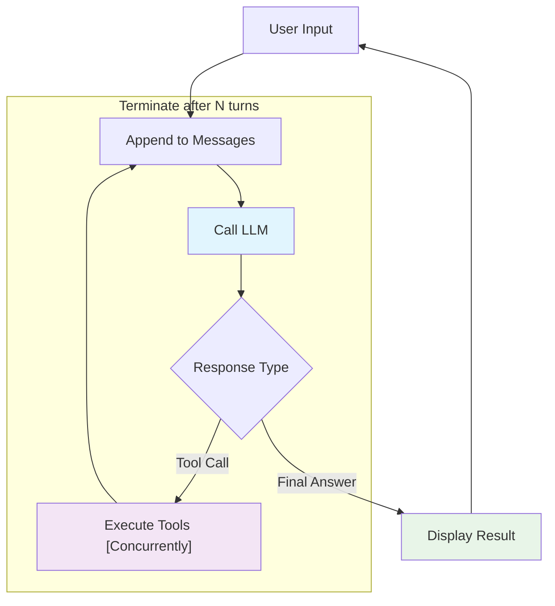

# ⚡ z007 🤖: Nimble AI Agent
_pronounced: "zee-double-oh-seven"_ 

## TL;DR

While frameworks like LangChain, Semantic Kernel, and AutoGen provide comprehensive toolkits with extensive abstractions, they can obscure the fundamental mechanics of how agents actually work. z007 explores the fundamentals and provides a simple, yet surprisingly useful agent with tools and Model Control Protocol (MCP) support that can be easily understood and modified.

****z007**** agent in about 600 lines demonstrates that effective AI agents operate on a few simple principles:

1. **Conversations and memory are basically lists of messages**.
2. **Tools and MCP are effectively lists of function(s)**.
3. **Function results are appended to the lists of messages**.
4. **LLM aggregates the above infers an answer or next function calls**
5. **Agentic workflow is just repetition of the above until terminated**.

Additionally **z007** can use generic OpenAI API over HTTP which allows to use **z007** with other LLM providers either locally or remote.

## Demo


## Quick start z007
### with AWS
```bash
AWS_PROFILE=<your profile> uvx z007@latest
```

### with local model
```bash
uvx z007@latest --provider openai --base-url http://localhost:1234/v1
```

## Baseline Architecture

### Agent Evaluation Loop



### Message Accumulation as State Management

Agent can use message history as their primary state:

```python
messages = []
messages.append({"role": "system", "content": [{"text": system_prompt}]}) # AWS Bedrock does it a bit differently 
messages.append({"role": "user", "content": [{"text": prompt}]})
```

```python
# AWS Bedrock way for system prompt
if self.system_prompt:
    converse_params["system"] = [{"text": self.system_prompt}]
```

Each turn adds to this list, building the context that enables coherent multi-turn conversations. 

### Tool Registry: Unified Interface for tool calling

Internally tools and MCPs are handled by ToolRegistry that manages individual python functions. MCP(s) then becomes a collection of functions that are invoked over JSON-RPC.

```python
class ToolRegistry:
    def __init__(self) -> None:
        self.tools: dict[str, Callable] = {}  # Local functions
        self.mcp_servers: dict[str, subprocess.Popen] = {}  # External processes
        self.mcp_tools: dict[str, str] = {}  # Tool → server mapping
```

### Tool Execution

Python functions become AI-callable tools through python introspection of function name, parameter names, doc string and associated type hints:

```python
def calculator_tool(expression: str) -> str:
    """Performs mathematical calculations"""
    return str(eval(expression))
```

```python
# Registry automatically converts to LLM tool spec:
{
    "toolSpec": {
        "name": "calculator_tool",
        "description": "Performs mathematical calculations", 
        "inputSchema": {"json": {"type": "object", "properties": {...}}}
    }
}
```

**Tool execution cycle:**
1. `LLM` decides to use tool → returns `tool_use` stop reason
   - **Why**: LLM recognizes it needs external data/computation beyond its training knowledge.
2. `Agent` extracts tool calls from returned message
   - **Why**: Parse structured tool requests to identify which functions to call with what parameters.
3. `ToolRegistry` executes tools concurrently using structured concurrency
   - **Why**: Parallel execution improves performance when multiple independent tools are needed.
4. `Agent` adds results back to the conversation as user message
   - **Why**: Tool outputs become part of conversation history, allowing LLM to reason about results.

## Turn-Based Conversation Loop

The conversation loop manages multi-step reasoning through iterative turns:

```python
async def run_conversation(self, prompt: str) -> list[Any]:
    messages = [...]  # Initialize with system prompt and user message
    
    for turn in range(self.max_turns):  # Prevent infinite loops
        response = await self.call_llm(messages, tool_config)
        
        if response['stopReason'] == 'tool_use':
            # Execute tools, add results to messages, continue
        else:
            break  # Final answer provided
    
    return responses
```

The `max_turns` parameter balances capability with reliability—too few limits complex reasoning, too many risks infinite loops.

## Complete Interaction Trace

**Input**: "What is 15 * 23, and then multiply that result by 2?"

**Turn 1**: LLM calls calculator → `calculator_tool("15 * 23")` → "345"  
**Turn 2**: LLM calls calculator → `calculator_tool("345 * 2")` → "690"  
**Turn 3**: LLM provides final answer → "First, 15 * 23 = 345. Then, 345 * 2 = 690. So the final answer is 690."

**Final message history**:
```python
[
    {"role": "user", "content": [{"text": "What is 15 * 23, and then multiply that result by 2?"}]},
    {"role": "assistant", "content": [{"toolUse": {...}}]},  # First calculation
    {"role": "user", "content": [{"toolResult": {...}}]},   # Result: "345"
    {"role": "assistant", "content": [{"toolUse": {...}}]},  # Second calculation  
    {"role": "user", "content": [{"toolResult": {...}}]},   # Result: "690"
    {"role": "assistant", "content": [{"text": "First, 15 * 23 = 345..."}]}
]
```

This demonstrates how message accumulation enables multi-step "reasoning".

## Framework Comparison and Design Choices

### When to Choose Comprehensive Frameworks

| Framework | Best For | Trade-off |
|-----------|----------|-----------|
| **LangChain** | Breadth of functionality, rapid prototyping | Complex abstractions can obscure debugging |
| **AutoGen** | Multi-agent conversations, role-based interactions | Complex message routing and lifecycle management |
| **Semantic Kernel** | Enterprise integration, Microsoft ecosystem | Steep learning curve, heavy configuration |


### When to Choose Purposeful Simplicity (z007)

**Readability**: Clear visibility into agent mechanics without deep framework abstractions.

**Custom requirements**: Easy to modify core behavior without fighting framework assumptions.

**Performance optimization**: Minimal overhead and direct control over async execution patterns.

## Conclusion

**z007** operates on simple principles: accumulated messages, structured tool calls, and turn-based reasoning loops. Understanding these fundamentals enables confident debugging, optimization, and extension regardless of framework choice.

