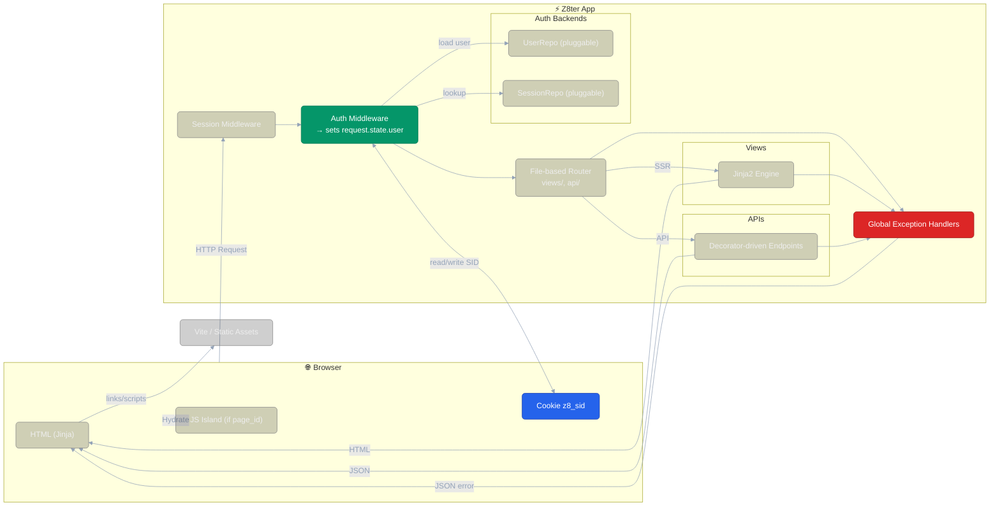

# Z8ter
**8ter** is a lightweight, Laravel-inspired full-stack Python web framework built on [Starlette], designed for rapid development with tight integration between backend logic and frontend templates plus small client-side “islands” where they make sense.


---

## Features

### 1) File-Based Views (SSR)
- Files under `views/` become routes automatically.
- Each view pairs Python logic with a Jinja template in `templates/`.
- A stable `page_id` (derived from `views/` path) is injected into templates and used by the frontend loader to hydrate per-page JS.

### 2) Jinja2 Templating
- Template inheritance with `` / ``.
- Templates live in `templates/` (default extension: `.jinja`).

### 3) CSR “Islands”
- A tiny client router lazy-loads `/static/js/pages/<page_id>.js` and runs its default export.
- Great for interactive bits (theme toggles, pings, clipboard, etc.) without going full SPA.

### 4) Decorator-Driven APIs
- Classes under `api/` subclass `API` and register endpoints with a decorator.
- Each class mounts under `/api/<id>` (derived from module path).

> Example shape (conceptual):
> ```
> api/hello.py      →  /api/hello
> views/about.py    →  /about
> templates/about.jinja + static/js/pages/about.js (island)
> ```

---

## Getting Started

### Prerequisites
- Python 3.11+ and `pip`
- Node 18+ and `npm`

### Install & Run (dev)
```bash
# 1) Python deps (in a venv)
python -m venv .venv
source .venv/bin/activate        # Windows: .\.venv\Scripts\Activate.ps1
pip install -r requirements.txt  # or: pip install -e .

# 2) Frontend deps
npm install

# 3) Dev server(s)
npm run dev
````

> `npm run dev` runs the dev workflow (backend + assets). Check the terminal for the local URL.

---

## Project Structure

```
.
├─ api/                     # API classes (@API.endpoint)
│  └─ hello.py
├─ views/                   # File-based pages (SSR)
│  └─ index.py
├─ templates/               # Jinja templates
│  ├─ base.jinja
│  └─ index.jinja
├─ static/
│  └─ js/
│     └─ pages/             # Per-page islands: about.js, app/home.js, ...
│        └─ common.js
├─ z8ter/                   # Framework core (Page, API, router)
└─ main.py                  # App entrypoint
```

---

## Usage Examples

### View + Template (SSR)

```jinja
{# templates/index.jinja #}


  <h1>{{ title }}</h1>
  <div id="api-response"></div>

```

### Client Island (runs when `page_id` matches)

```ts
// static/js/pages/common.ts (or a specific page module)
export default async function init() {
  // hydrate interactive bits, fetch data, etc.
}
```

### Minimal API Class

```python
# api/hello.py
from z8ter.api import API

class Hello(API):
    @API.endpoint("GET", "/hello")
    async def hello(self, request):
        return {"ok": True, "message": "Hello from Z8ter"}
```

### Main Application (bootstrapping 8ter)

Your app entrypoint defines the pipeline of features by chaining builder steps.
This example shows a minimal project with templating, Vite, and authentication wired in.

```python
# main.py
from z8ter.builders.app_builder import AppBuilder
from app.identity.data.session_repo import InMemorySessionRepo
from app.identity.data.user_repo import InMemoryUserRepo

app_builder = AppBuilder()
app_builder.use_config(".env")             # load environment config
app_builder.use_templating()               # enable Jinja2 templates
app_builder.use_vite()                     # dev/prod asset handling
app_builder.use_auth_repos(                # provide your own repos
    session_repo=InMemorySessionRepo(),
    user_repo=InMemoryUserRepo()
)
app_builder.use_authentication()           # auth middleware + request.state.user
app_builder.use_errors()                   # global JSON error handlers

if __name__ == "__main__":
    app = app_builder.build()
```

### Authentication (Sessions + Users)

8ter ships with a minimal but flexible authentication layer.
You provide two repos — `SessionRepo` and `UserRepo` — and 8ter wires them into middleware that sets `request.state.user`.

#### Setup in AppBuilder

```python
from z8ter.auth.inmemory_repos import InMemorySessionRepo, InMemoryUserRepo

builder.use_sessions()  # enables secure cookie handling

builder.use_auth_repos(
    session_repo=InMemorySessionRepo(),
    user_repo=InMemoryUserRepo()
)

builder.use_authentication()  # middleware populates request.state.user
```

---

##  Planned
* **Stripe integration**: pricing page, checkout routes, webhooks
* **DB adapters**: SQLite default, Postgres option

---

## Philosophy

* Conventions over configuration
* SSR with CSR islands
* Small surface area; sharp, pragmatic tools
